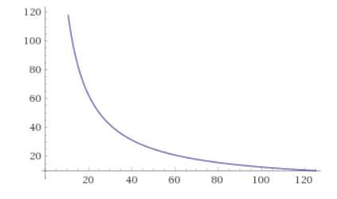

.. meta::
   :description: SmartCash features several unique value propositions including smartrewards, smartnodes, instantpay, Smartcard, and a decentralized governance system
   :keywords: smartcash, cryptocurrency, blockchain, documentation, guide, smartrewards, smartnodes, SmartBand, Electrum Wallet, mining, wallets, merchants, smarthive, instantpay, smartcard, smartvote, smartpay, NFC support for SmartCard, SmartVault

.. _features:

========
Features
========

.. _specifications:

Specifications
==============

- First block mined at 11:24 PM, July 11, 2017 
- No premine
- Keccak hashing algorithm, GPU mining available
- 55 seconds block time, 4MB blocks, ~232 transactions per second
- BlockReward = 5000x(143,500/BlockHeight)(max.5000)
- BRNDF difficulty adjustment algorithm
- 5 Billion total coin supply
- Instant transactions using instantpay
- Decentralized Governance By Blockchain allows SMART owners to
  vote on budget proposals and decisions that affect SmartCash

.. _smartrewards:

Smartrewards
============
SmartRewards are a method of distributing block rewards among
SmartCash addresses holding at least 1000 SmartCash and has no
outgoing transaction over the period of 47500 Blocks in order to
disperse voting power and coin production among the wider
community. This allows for a more decentralized creation of block
rewards. Payouts occur 200 Blocks after the cycle ends and every
second block 1000 addresses receive rewards. SmartNodes will keep
track on which addresses are eligible and which are not.
.. _smartnodes:

Smartnodes
==========

In addition to traditional Proof of Work (PoW) rewards for mining SmartCash,
users are also rewarded for running and maintaining special servers
called smartnodes. Thanks to this innovative two tier network, SmartCash can
offer innovative features in a trustless and decentralized way.
Smartnodes are used to power instantpay, smartreward, and the
other features. Users are rewarded for running
smartnodes; 10% of the block reward is allocated to pay the smartnodes
network. You can view practical guides on all topics relating to
smartnodes :ref:`here <smartnodes>`.

Smartnodes enable the following services:

-  **InstantPay** Allows for SmartCash transactions to be locked in about a second. No risk of double spending a transaction, so the receiver can trust that transaction immediately.
-  **Smartrewards** are calculated by the SmartNodes to allow for distribution to be handled automatically by the block rewards.
-  **Electrum Servers** Servers used for Electrum wallets.
-  **SmartCard SDK** Build the SmartCash payment card that can handle world usage in replacement of card schemes.

SmartNodes are required to have 10,000 SMART collateral, a dedicated VPS (IPv4 address, 1GB RAM, 20GB drive) and be able to run 24 hours a day without a more than two hour of connection loss.

SmartNodes cost money and effort to host so they are paid a percentage
of the block reward as an incentivize.
This `tool <https://smartcash.cc/smartnodes/#toggle-id-1>`_ shows a live calculation of
smartnode earnings. These rewards decrease by time, but the
rising value of Smart may offset these reductions.

.. _instantpay:

InstantPay
===========

Traditional decentralized cryptocurrencies must wait for certain period 
of time for enough blocks to pass to ensure that a transaction is both 
irreversible and not an attempt to double-spend money which has already 
been spent elsewhere. This process is time-consuming, and may take 
anywhere from 15 minutes to one hour for the widely accepted number of 
six blocks to accumulate. Other cryptocurrencies achieve faster 
transaction confirmation time by centralizing authority on the network 
to various degrees.

SmartCash suffers from neither of these limitations thanks to its 
second-layer network of smartnodes. Smartnodes can be called upon to 
form voting quorums to check whether or not a submitted transaction is 
valid. If it is valid, the smartnodes "lock" the inputs for the 
transaction and broadcast this information to the network, effectively 
promising that the transaction will be included in subsequently mined 
blocks and not allowing any other spending of these inputs during the 
confirmation time period.

InstantPay technology will allow for cryptocurrencies such as SmartCash to 
compete with nearly instantaneous transaction systems such as credit 
cards for point-of-sale situations while not relying on a centralized 
authority. Widespread vendor acceptance of SmartCash and InstantPay could
revolutionize cryptocurrency by shortening the delay in confirmation of
transactions from as long as an hour (with Bitcoin) to as little as a 
few seconds.

You can view a practical guide to use InstantPay 
:ref:`here <instantpay>`.

**How SmartCash 'InstantPay' Protects Merchants from Double Spends**,
SmartCash Detailed

.. raw:: html

    

        <iframe src="//www.youtube.com/embed/x_HJ5M_4dcE" frameborder="0" allowfullscreen style="position: absolute; top: 0; left: 0; width: 100%; height: 100%;"></iframe>
    

.. _smartvote:

Smartvote
=========

All Smartcash users deserve a voice, from day #1. That is why Smartcash is pioneering in the crypto-governance space and was built around Smarthive, the platform that lets all users vote on the direction of the project. More information will be released soon describing this platform in depth.

Basically, each SmartCash coin is worth 1 vote, to keep it simple.
.. _smartcard:

Smartcard
==========

`Smartcard <https://smartcash.cc/smartcard>`_ Debit and credit card payments have become the dominant way for
many to carry out most, if not all, of their daily transactions. Adoption of
card payments became increasingly simple for small businesses and
now quick and affordable smartphone-powered solutions have
widespread adoption.
SmartCard emerged offering to solve many of the problems traditional
payment systems are facing such as long settlement times,
chargebacks, and high fees. SmartCard is a blockchain-based solution
that aims to improve on the digital payment card model. Our main goals
are to streamline crypto transactions and make them practical for use in
real-life payment scenarios. At the same time we aim to drastically
reduce fees and confirmation time frames over those found in current
solutions.
The SmartCard makes it possible to pay with SmartCash using a
physical card where no mobile wallet or phone internet access is
required. Since the SmartCard doesn’t use a bank or a credit card
processor, transactions are not subject to any restrictions. Merchants
will have a point of sale (POS) app, so they transmit transactions for
you but can’t initiate the payment without your permission.
For further information about how the system works and how both
merchants and customers will benefit from using the SmartCard and
SmartCash POS App please visit: smartcash.cc/smartcard/

SmartBand
---------

The SmartBand is a partnership between Stratum, ATAR, and
SmartCash. ATAR launched a wristband which is linked to an account
where people in Brazil can deposit fiat and pay with it for their daily
needs using NFC technology built in the band at over 2.5 million
merchants.
The partnership with Stratum, an international exchange, makes it
possible to link your exchange SmartCash wallet with your SmartBand
to load the ATAR account with SmartCash. Stratum automatically
converts SmartCash to the local currency required for purchases. Once
a payment is done, you will receive a notification on your phone for
each transaction.
With over 85% of all point of sale terminals in Brazil accepting the ATAR
Band, this pioneering cooperation allows SmartCash to be accepted
broadly by merchants with no additional steps, technology, or training
required.

.. _smartvote:

SmartHive Governance and Hive Teams
===================================
The one feature that sets SmartCash apart is the SmartHive
governance model and how the community can vote to fund the best
projects with block rewards stored in the SmartHive Project Treasury
and administered by the SmartHive.
The idea is that the SmartHive Governance Portal engages community
members and other 3rd parties interested in growing SmartCash into a
global currency. Everyone can create a proposal that helps SmartCash
in some way with a fee of 100 SMART. Then every SmartCash holder
also can participate in the voting process and help decide if its worth
getting funded or not by the SmartHive Project Treasury.
All users have the ability to vote; 1 SMART equals 1 vote. Proposals are
open to vote for 14 days, with one day extensions if the vote outcome
changes at the end of that period and payments will be made in
accordance with the delivered milestones. Proposals open to vote can
be found at: vote.smartcash.cc
A major difference compared to other cryptocurrencies is that we
believe core teams can ultimately lead to inefficiency and centralization.
In order to create and maintain a decentralized governance structure
SmartCash has Hive Structuring Teams. These teams are in charge of
vital project areas, such as development, outreach and support and
consist of people directly involved in the project. Every Hive Team runs
independently, but cooperatively resulting in organic growth.

.. _keccak-hash-algorithm:

Keccak Hash Algorithm
=====================
Keccak (pronounced as “ketchak”) also known as SHA-3 (Secure Hash Algorithm 3). It is the latest generation secure hashing algorithm released by NIST (National Institutes of Standards and Technology) in 2012. Keccak is a family of cryptographic sponge functions and is designed as an alternative to SHA-256 – An algorithm used by Bitcoin and various other crypto currencies. Compared to SHA-256, Keccak (SHA-3) is much faster and is more secure. If you are looking for Keccak Whitepaper then head to this link. If you are looking for specifications and more in-depth information on Keccak encryption algorithm then check this and this.
Information on mining with Keccak can be found in the :ref:`Mining
<mining>` section of this documentation.

Advantages of Keccak
--------------------

Keccak is a SHA-3 hashing algorithm and as it is a member of SHA family it isn’t 100% ASIC resistant. In fact it is ASIC friendly but as far as we know there isn’t an ASIC currently for this algorithm.

.. _emission-rate:

Emission Rate
=============

Cryptocurrencies such as SmartCash and Bitcoin are created through a
cryptographically difficult process known as mining. Mining involves
repeatedly solving :ref:`hash algorithms <keccak-hash-algorithm>`. Once discovered, the miner is 
permitted to create new units of the currency. This is known as the 
block reward. To ensure that the currency is not subject to endless 
inflation, the block reward is reduced at regular intervals, as `shown 
in this calculation
<https://www.wolframalpha.com/input/?i=plot+5000+*+143500%2F(x*573454.54),+x+from+1+to+125>`_.
Graphing this data results in a curve showing total coins in 
circulation, known as the coin emission rate.

While SmartCash is based on Bitcoin, it significantly modifies the coin
emission rate to offer a smoother reduction in coin emission over time.
While Bitcoin reduces the coin emission rate by 50% every 4 years, SmartCash first year is approximately then 717,565,000+998,173,000=1,715,738,000 or 34.31% of the maximum supply.

Year 2 generates an additional 500 Million SmartCash, bringing the total supply to about 2.2 Billion out of the total 5 Billion, or 44% (calculation here).

Year 3 generates even less about 291.7 Million more SmartCash (calculation here), for a total supply of about 50%, or 2.5Billion out of 5 Billion. The remainder is spread over the next 121 years.

   SmartCahs coin emission rate 125 Years

Total coin emission
-------------------

`Bitcoin's total coin emission <https://docs.google.com/spreadsheets/d/1
2tR_9WrY0Hj4AQLoJYj9EDBzfA38XIVLQSOOOVePNm0/pubhtml?gid=0&single=true>`_
can be calculated as the sum of a geometric series, with the total
emission approaching (but never reaching) 21,000,000 BTC. This will
continue until 2140, but the mining reward reduces so quickly that 99%
of all bitcoin will be in circulation by 2036, and 99.9% by 2048.

`SmartCash's total coin emission <https://www.wolframalpha.com/input/?i=plot+5000+*+143500%2F(x*573454.54),+x+from+1+to+125>`_. SmartCash will emit coins for
approximately 124.3 years before a full year of mining creates less than 1
SMART. After 2141 no more SMART will be created. 
`Read more here <https://smartcash.blockchainlibrary.org/2018/06/understanding-the-smartcash-emission-curve-and-distribution-rates/>`

Block reward allocation
-----------------------

Unlike Bitcoin, which allocates 100% of the block reward to miners, SmartCash allocates:

+-----+----------------------------------------+
| 5% | Mining Reward                           |
+-----+----------------------------------------+
| 10% | Smartnodes                             |
+-----+----------------------------------------+
| 15% | SmartRewards                           |
+-----+----------------------------------------+
|  4% | x6 Hive Structuring Teams              |
+-----+----------------------------------------+
| 46% | SmartHive Project Treasury             |
+-----+----------------------------------------+

.. _fees:

Fees
====

Transactions on the SmartCash network are recorded in blocks on the
blockchain. The size of each transaction is measured in bytes, but there
is not necessarily a correlation between high value transactions and the
number of bytes required to process the transaction. Instead,
transaction size is affected by how many input and output addresses are
involved, since more data must be written in the block to store this
information. Each new block is generated by a miner, who is paid for
completing the work to generate the block with a block reward. In order
to prevent the network from being filled with spam transactions, the
size of each block is artificially limited. As transaction volume
increases, the space in each block becomes a scarce commodity. Because
miners are not obliged to include any transaction in the blocks they
produce, once blocks are full, a voluntary transaction fee can be
included as an incentive to the miner to process the transaction. Most
wallets include a small fee by default, although some miners will
process transactions even if no fee is included.

SmartCash also supports

:ref:`instantpay` transactions, which operate on
a different and mandatory fee schedule. SmartCash introduced
InstantPay autolocks, which causes smartnodes to automatically attempt
to lock any transaction with 4 or fewer inputs — which are referred to
as “simple” transactions — and removes the additional fee for
InstantPay. The fee schedule for SmartCash as of December 2018 is as
follows:

+----------------------+-----------------+-----------------------------------+
| Transaction type     | Recommended fee | Per unit                          |
+======================+=================+===================================+
| Standard transaction | .00001 SMART    | Per kB of transaction data        |
+----------------------+-----------------+-----------------------------------+
| InstantPay autolock  | .00001 SMART    | Per kB of transaction data        |
+----------------------+-----------------+-----------------------------------+
| InstantPay           | .0001 SMART     | Per transaction input             |
+----------------------+-----------------+-----------------------------------+

As an example, a standard and relatively simple transaction on the SmartCash
network with one input, one output and a possible change address
typically fits in the range of 200 - 400 bytes. Assuming a price of
US$1 per SMART, the fee falls in the range of $0.000002 - $0.000004, or
1/5000th of a cent. Processing a simple transaction using InstantPay at
the same price is free of charge, while more complex InstantPay
transactions may cost around 0.01-0.02 cents per transaction, depending on the
number of inputs. These fees apply regardless of the SmartCash or dollar
value of the transaction itself.

