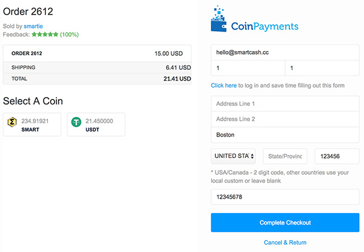
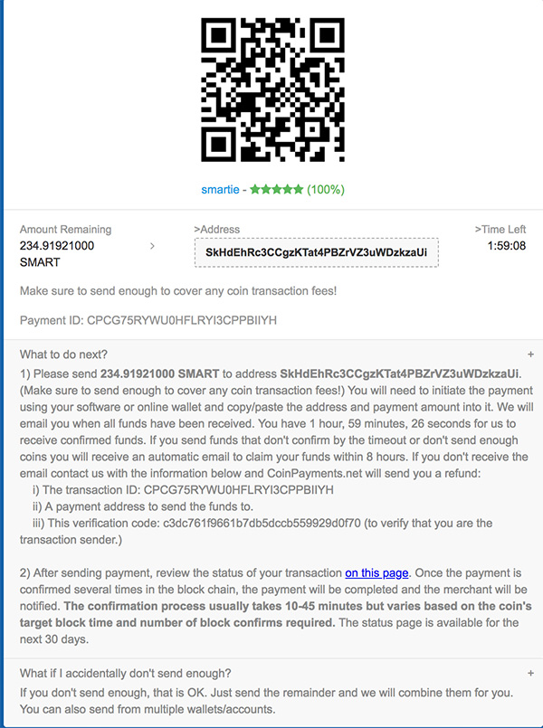

.. meta::
   :description: Guide for merchants getting started with SmartCash. Online and offline payment processors
   :keywords: smartcash, pos, merchants, payment processor, store, wordpress, woocommerce, coinpayments, point of sale

.. _merchants:

.. include:: <isopub.txt>

===============
Getting Started
===============

SmartCash welcomes new merchants and supports integration through a
standardised onboarding process. It's easy to begin accepting payments
in SmartCash and enjoy the following benefits:

- Settlement within seconds and clearance within minutes
- Ability to accept payments from any market around the world so help you grow your customer base
- Irreversible transactions to prevent fraud
- Advanced privacy for both customers and merchants
- Lowest fees in the industry
- Pos Solutions and Ecommerce Plugins

How to integration SmartCash is available in English on
`SmartCash for Merchants <https://find.smartcash.cc/for-merchants/>`_. 

Many major merchants accept SmartCash - check out `Taco
<https://www.taco.com.br/>`__ or `Boralatour
<https://boralatour.com.br/>`__ for examples of what merchant integration
can look like. Once you are up and running accepting SmartCash, consider
adding your business to the directory maintained at `SmartCash Merchant Directory
<https://find.smartcash.cc>`_ for increased visibility.

Payment Processors
==================

This section lists known payment processors supporting SmartCash and the
business platforms they support. Please conduct thorough research before
choosing a payment provider to ensure your needs will be met. 

For more advanced payment processing needs, such as for high risk
merchant accounts in industries challenged with high levels of
chargebacks, it is recommended to contact SmartCash partner `Coinpayments
<https://www.coinpayments.net/>`__.

Online Stores
-------------

Due to the wide range of platforms for online stores, the following
table is intended to help you select an appropriate payment processor
for your existing store.

`CoinPayments <https://www.coinpayments.net>`_ 

Point of Sale
-------------

A range of Point of Sale systems are available. Many function as an app
or simple website serving a checkout interface and QR code generator,
while others support custom features such as NFC or a rewards scheme. SmartPay and SmartCard are
particularly widespread.

SmartCard
  .. image:: img/smartcard.png
     :width: 400px
     :align: right
     :target: https://card.smartcash.cc/

  https://card.smartcash.cc/

  The SmartCard is a way to hold SMART on a physical card. You don’t need a phone to hold your SMART. If you have ever had a problem with using a phone inside a building…you will get why this is ideal. Only the merchant needs the internet connection. As simple to use as a credit or debit card but not controlled by any 3rd party processor. And not a preloaded card using a visa fiat system…this is real crypto to crypto.

SmartPay
  .. image:: img/smartpay.gif
     :width: 400px
     :align: right
     :target: https://business.smartcash.cc/

  https://business.smartcash.cc/

  Accept SmartCash as a payment option in your business with zero fees using a simple SmartCash app. The SmartPay app is available for use anywhere in the world, all it requires is access to the internet.

This app will allow you to:

- Accept payments instantly from a customer’s SmartCard’s using SmartCash’s Instantpay technology.
- Receive payments from the customer to your business with no 3rd party.
- Manage different store locations with individual SmartPay staff logins.
- Allow optional tipping for staff on all transactions.

Have peace of mind with SmartPay's security features:

- SmartPay processes transactions without access to business funds
- Private keys are created by you or generated in the browser
- Divide payments into different wallets with HD Wallet or Multi Address
- Decentralized payment system gives you full control of your funds.

Start accepting cryptocurrency payments in your business with 0% fees, and download the SmartPay app today! Visit https://business.smartcash.cc to learn more.

SmartCash Ecommerce Plugins
---------------------------

Make your website run Wordpress become Ecommerce store with WooCommerce Plugin 

`SmartCash WooCommerce Plugins <https://github.com/SmartCash/WooCommerce>`_

WooCommerce and CoinPayments.net
--------------------------------

If your online store is built on WooCommerce, you can simply install
CoinPayments as an additional payment gateway and immediately begin
accepting SmartCash. This guide assumes you have already `installed Wordpress
<https://codex.wordpress.org/Installing_WordPress>`_, `installed
WooCommerce <https://docs.woocommerce.com/document/installing-
uninstalling-woocommerce/>`_ and `created at least one product
<https://docs.woocommerce.com/document/managing-products>`_ in your
store. A `video <https://www.youtube.com/watch?v=Xa2o_8s3RNY>`_ of the
process to install the CoinPayments payment processor is also available.

In your WordPress administration backend, select **Plugins -> Add New**
and type "coinpayments.net" into the search box. A plugin named
**CoinPayments.net Payment Gateway for WooCommerce** should appear.
Click **Install Now** to install the plugin. Alternatively, you can
`download the plugin <https://wordpress.org/plugins/coinpayments-
payment-gateway-for-woocommerce>`_ from the WordPress website as a zip
file and upload it using the **Upload Plugin** button. Once the plugin
is installed, click **Activate** to begin configuration.

.. figure:: img/coinpayments-plugin.png
   :width: 400px

   Installing the CoinPayments.net WooCommerce plugin

Next, go to CoinPayments.net and `sign up
<https://www.coinpayments.net/register>`_ to create an account. Once you
are logged in, go to **Account -> Coin Acceptance Settings** and enable
SmartCash, as well as optionally entering a withdrawal address. Next, go to
**Account -> Account Settings** and copy **Your Merchant ID** from the
**Basic Settings** area into a text file. Then navigate to the
**Merchant Settings** section and enter a long, random series of
characters for the **IPN Secret**. Copy this code to your temporary file
as well.

Back in the WordPress plugins section, click the **Settings** button for
the WooCommerce plugin and navigate to **Checkout -> CoinPayments.net**
section. Ensure the CoinPayments plugin is enabled here, then enter the
**Merchant ID**, **IPN Secret** and **Description** in the appropriate
fields as shown below. Click **Save Changes** when you are ready.

.. figure:: img/coinpayments-settings.png
   :width: 550px

   Configuring the CoinPayments.net WooCommerce plugin

Your customers will now see an option to pay with SmartCash when completing
the checkout process for an order. The payment will be processed by
CoinPayments.net, and you will receive emails detailing each purchase
procedure. You can choose how often you want to withdraw your payments,
to which SmartCash address and various other options in the CoinPayments
administration section. See the `CoinPayments Documentation
<https://www.coinpayments.net/help>`_ or `Merchant Tools
<https://www.coinpayments.net/merchant-tools>`_ for more information.

.. image:: img/coinpayments-confirm.png
   :width: 400px

.. figure:: img/coinpayments-paid.png
   :width: 250px

   Completing payment through the CoinPayments.net payment processor
   
Installation Examples
=====================

This section contains worked examples of how to install, configure and
process your first payment using the payment processors listed in this
documentation.

https://find.smartcash.cc/a-guide-to-accepting-smartcash-payments-for-your-online-store/

