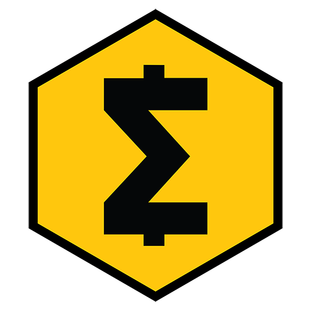

.. meta::
   :description: Technical guides for merchants using SmartCash. API and SDK resources.
   :keywords: smartcash, merchants, payment processor, API, SDK, insight, instantpay, vending machines

.. _merchants-technical:

================
Technical Guides
================

SmartCash Wallet Integration
============================

`SmartCash NodeClient <https://github.com/SmartCash/Core-Smart/releases/>`__ is a fork of
Bitcoin and the majority of functionality included in the SmartCash NodeClient
Daemon can be integrated in a similar manner. Key differences relate to
customizations to existing JSON-RPC commands to support unique
functionalities such as InstantPay. These differences, as well as more
general information, are summarized below.

1. **General Information:** SmartCash is a “Proof of Work” blockchain with
   attributes similar to that of Bitcoin.

   a. Block Time: ~55 seconds per Block
   b. Blockchain Confirmations: 6 Confirmations (or 2 in the case of 
      InstantPay)
   c. Github Source: https://github.com/SmartCash/Core-Smart
   d. Release Link: https://github.com/SmartCash/Core-Smart/releases/

2. **JSON-RPC Interface:** The majority of Bitcoin JSON-RPC commands are
   unchanged making integration into existing systems relatively
   straightforward. For a complete listing of RPC commands see the 
   `command-line options <https://smartcash.freshdesk.com/support/solutions/articles/35000027145>`__.

   It’s worth noting that several key Transaction-related JSON-RPC
   commands have been modified to support InstantPay.
   
3. **Block Hashing Algorithm:** SmartCash uses the “keccak” algorithm in place
   of SHA256 used in Bitcoin. It’s important to note, however, that this
   only affects the hashing of the Block itself. All other internals
   utilize SHA256 hashes (transactions, merkle root, etc) which allows 
   for most existing libraries to work in the SmartCash ecosystem.

4. **Supporting Libraries:** Due to the aforementioned differences in
   Hashing Algorithm only minor adjustments are required before using
   Bitcoin libraries on the SmartCash network. The most popular libraries
   have already been ported to SmartCash which has enabled support for most
   major programming languages. These resources are outlined in the
   :ref:`SDK Resources <sdk-resources>` section of this document.

.. _integration:

Integration Notes
=================

.. _api-services:

API Services
============

Several API services exist to facilitate quick and easy integration with
the SmartCash network for services including:

- Transaction broadcasting
- Exchange rates
- Currency conversion
- Invoice generation

API Services are typically leveraged to eliminate that requirement of
running your own infrastructure to support blockchain interactions. This
includes mechanisms such as:

- Forming and Broadcasting a Transaction to the network.
- Address generation using HD Wallets.
- Payment Processing using WebHooks.

There are a variety of options for supporting these methods, with the
key differentiator being the pricing model included and supported
features. The following list of API Providers attempts to outline these
key features/differentiators and also includes a link to related
documentation.

Insight
-------

https://insight.smartcash.cc/api
https://github.com/SmartCash/smart-insight-api

The open-source Insight REST API provides you with a convenient,
powerful and simple way to read data from the SmartCash network and build
your own services with it. A practical guide to getting started with the
Insight API and Insight UI block explorer is available :ref:`here
<insight-api>`.

- Features: Transaction Broadcast, WebSocket Notifications.
- Pricing Model: Free / Open Source
- Documentation: https://github.com/bitpay/insight-api

CoinPayments
------------

.. image:: img/coinpayments.png
   :width: 200px
   :align: right
   :target: https://www.coinpayments.net

https://www.coinpayments.net

CoinPayments is an integrated payment gateway for cryptocurrencies
such as SmartCash. Shopping cart plugins are available for all popular
webcarts used today. CoinPayments can help you set up a new checkout,
or integrate with your pre-existing checkout.

- Features: Invoicing, Exchange Rates, WebHook Callbacks. CoinPayments
  holds Private Keys on their server allowing merchant to withdraw
  funds in Cryptocurrency or convert to Fiat.
- Integrations: aMember Pro, Arastta, Blesta, BoxBilling, Drupal,
  Ecwid, Hikashop, Magento, OpenCart, OSCommerce, PrestaShop, Tomato
  Cart, WooCommerce, Ubercart, XCart, ZenCart
- Pricing Model: 0.5% Processing Fee
  (https://www.coinpayments.net/help-fees)
- Documentation: https://www.coinpayments.net/apidoc

.. _sdk-resources:

SDK Resources
=============

SDKs (Software Development Kits) are used to accelerate the design and
development of a product for the SmartCash Network. These resources can
either be used to interface with an API provider or for the creation of
standalone applications by forming transactions and/or performing
various wallet services.

SmartCash Developer Guide
-------------------------

https://github.com/SmartCash/Core-Smart

The SmartCash Developer Guide aims to provide the information you need to
understand SmartCash and start building SmartCash-based applications. To make the
best use of this documentation, you may want to install the current
version of SmartCash Core, either from source or from a pre-compiled
executable.

- Documentation: https://github.com/SmartCash/Core-Smart

SmartCard SDK
-------------

https://github.com/SmartCash/Core-Smart

Easy create your smartcard from your website

Open with button click - Auto Open False

.. code-block:: html

    <button type="submit" onclick="SmartCard.openModal()">Create SmartCard</button>

Open on page load - Auto Open True

.. code-block:: html

    

Add CSV to zip - Generate CSV True

.. code-block:: html

    

PHP: Bitcoin-PHP
----------------

https://github.com/Bit-Wasp/bitcoin-php

Bitcoin-PHP is an implementation of Bitcoin with support for SmartCash using
mostly pure PHP.

- Platform: PHP
- Documentation: https://github.com/Bit-Wasp/bitcoin-php/blob/master/doc/Introduction.md
- Repository: https://github.com/Bit-Wasp/bitcoin-php

Python: PyCoin
--------------

https://github.com/richardkiss/pycoin

PyCoin is an implementation of a bunch of utility routines that may be
useful when dealing with Bitcoin and SmartCash. It has been tested
with Python 2.7, 3.6 and 3.7.

- Platform: Python
- Documentation: https://pycoin.readthedocs.io/en/latest/
- Repository: https://github.com/richardkiss/pycoin

.NET: NBitcoin
--------------

https://github.com/MetacoSA/NBitcoin

NBitcoin is the most complete Bitcoin library for the .NET platform, and
has been patched to include support for SmartCash. It implements all most
relevant Bitcoin Improvement Proposals (BIPs) and SmartCash Improvement
Proposals (DIPs). It also provides low level access to SmartCash primitives
so you can easily build your application on top of it.

- Platform: .NET
- Documentation: https://programmingblockchain.gitbooks.io/programmingblockchain/content/ 
- Repository: https://github.com/MetacoSA/NBitcoin

BlockCypher
-----------

.. image:: img/blockcypher.png
   :width: 200px
   :align: right
   :target:  https://www.blockcypher.com

https://www.blockcypher.com

BlockCypher also offers client SDKs.

- Platform: Ruby, Python, Java, PHP, Go, NodeJS
- Repositories: https://www.blockcypher.com/dev/SmartCash/#blockcypher-supported-language-sdks 

GoCoin
------

.. image:: img/gocoin.png
   :width: 200px
   :align: right
   :target: https://gocoin.com

https://gocoin.com

- Platform: JavaScript, PHP, Java, Ruby, .NET, Python
- Repositories: https://gocoin.com/docs 

InstantPay
===========

InstantPay is a feature provided by the SmartCash network that allows for
0-confirmation transactions to be safely accepted by Merchants and other
service providers. Secured by the Smartnode Network, this mechanism
eliminates the risk of a “Double Spend” by locking transaction inputs
for a given transaction at a protocol level.

InstantPay Transactions vs. Standard Transactions
--------------------------------------------------

From an integration perspective there are only minor differences between
an InstantPay Transaction and a Standard Transaction. Both transaction
types are formed in the same way and are signed using the same process;
the key difference is the fee structure and input requirements for
InstantPay. 

#. Fee Structure: InstantPay utilizes a “per-input” fee of 0.001 SmartCash
   per Input.
#. Input Requirements: All inputs for an InstantPay transaction must
   have at least 2 confirmations.
   
#. Amount: Total amount
   InstantPay limits the total coins that can be locked in a transaction to %1 SMART and must less than 100k.  You may need to use a normal transaction to split large deposits before you can send with InstantPay.

In the event that a given transaction does not meet both criteria it
will revert to a standard transaction.

Receiving InstantPay Transactions
----------------------------------

InstantPay transactions are handled in the same way as a Standard
Transaction, typically through JSON-RPC, Insight API, or an internal
notification script / service that is configured at a server level.

#. JSON-RPC: The following RPC commands will include InstantPay-related
   information. Within the response you’ll find an “InstantLock” field
   the status of a given Transaction. This true/false (boolean) value
   will indicate whether an InstantPay has been observed.
 	

#. Insight API: Insight API can be used to detect InstantPay
   transactions and to push notifications to clients using WebSockets.
   The API can also be manually polled to retrieve Transaction
   information including InstantPay status.

Broadcasting InstantPay Transactions
-------------------------------------

InstantPay Transactions can be constructed and broadcast using an
approach similar to Standard Transactions. Provided the InstantPay Fee
Structure and Input Requirements are met, an InstantPay can be
broadcast using JSON-RPC or Insight API as a Raw Transaction.

#. JSON-RPC: The “SendRawTransaction” RPC command can be utilized to
   broadcast a raw transaction using InstantPay. When utilizing this
   command be sure to set both optional parameters as “true”

   ``sendrawtransaction "hexstring" ( allowhighfees InstantPay )``
   ``sendrawtransaction "hexstring" true true``

   More Information: https://github.com/SmartCash/Core-Smart/

#. Insight API: Raw Transactions can also be broadcast as an InstantPay
   using Insight API. In this case all that is required is to POST the
   raw transaction using the ``/tx/sendix`` route.

   More Information: https://github.com/SmartCash/Core-Smart/

Additional Resources
--------------------

The following resources provide additional information about InstantPay
and are intended to help provide a more complete understanding of the
underlying technologies.

Vending Machines
================

Price Tickers
=============

You can add a simple price ticket widget to your website using the
simple `code snippet generator from CoinGecko
<https://www.coingecko.com/en/coins/smartcash/widgets#panel>`_.

.. raw:: html

    
    <coingecko-coin-ticker-widget currency="usd" coin-id="smartcash" locale="en"></coingecko-coin-ticker-widget>
    

QR Codes
========

Many wallets are capable of generating QR codes which can be scanned to
simplify entry of the SmartCash address. Printing these codes or posting the
on your website makes it easy to receive payment and tips in SmartCash, both
online and offline.

- In SmartCash NodeClient, go to the **Receive** tab, generate an address if
  necessary, and double-click it to display a QR code. Right click on
  the QR code and select **Save Image** to save a PNG file.
