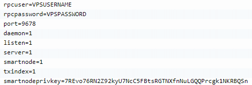

.. meta::
   :description: Installing Dash using a package manager
   :keywords: smartcash, cryptocurrency, fedora, ubuntu, rpm, apt, git, smartnode, install, binary

.. _smartnode_advanced:

===============
Advanced Topics
===============

Installing SmartCash on Windows VPS
===================================

Install wallet as normal. 
The configuration file is a list
of ``setting=value`` pairs, one per line, with optional comments
starting with the ``#`` character.

The configuration file is not automatically created; you can create it
using your favorite plain-text editor. By default, smartcash-qt (or smartcashd) will look for a file named ``smartcash.conf`` in the smartcash data directory, but both the data directory and the configuration file path may be changed using the -datadir and -conf command-line arguments.

+----------+--------------------------------+-----------------------------------------------------------------------------------------------+
| Platform | Path to data folder            | Typical path to configuration file                                                            |
+==========+================================+===============================================================================================+
| Linux    | ~/                             | /home/username/.smartcash/smartcash.conf                                                      |
+----------+--------------------------------+-----------------------------------------------------------------------------------------------+
| macOS    | ~/Library/Application Support/ | /Users/username/Library/Application Support/smartcash/smartcash.conf                          |
+----------+--------------------------------+-----------------------------------------------------------------------------------------------+
| Windows  | %APPDATA%                      | (Vista-10) C:\\Users\\username\\AppData\\Roaming\\SmartCash\\smartcash.conf                   |
|          |                                |                                                                                               |
|          |                                | (2000-XP) C:\\Documents and Settings\\username\\Application Data\\SmartCash\\smartcash.conf   |
+----------+--------------------------------+-----------------------------------------------------------------------------------------------+

Copy and paste the following text to get
started, then replace the variables specific to your configuration as
follows::

  #----
  rpcuser=XXXXXXXXXXXXX
  rpcpassword=XXXXXXXXXXXXXXXXXXXXXXXXXXXX
  rpcallowip=127.0.0.1
  port=9678
  #----
  listen=1
  server=1
  daemon=1
  maxconnections=64
  #----
  smartnode=1
  smartnodeprivkey=XXXXXXXXXXXXXXXXXXXXXXX
  externalip=XXX.XXX.XXX.XXX
  #----

Replace the fields marked with ``XXXXXXX`` as follows:

- ``rpcuser``: enter any string of numbers or letters, no special
  characters allowed
- ``rpcpassword``: enter any string of numbers or letters, no special
  characters allowed
- ``smartnodeprivkey``: this is the legacy smartnode private key you
  generated in the previous step
- ``externalip``: this is the IP address of your VPS

The result should look something like this:

   Entering smartnode genkey data in smartcash.conf

