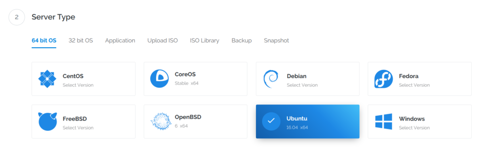
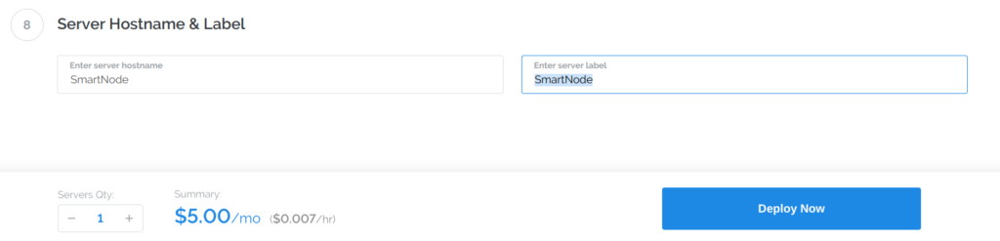

.. meta::
   :description: This guide describes how to set up a SmartCash smartnode. It also describes various options for hosting and different wallets
   :keywords: smartcash, guide, smartnodes, trezor, setup

.. _smartnode-setup:

=====
Setup
=====

Setting up a smartnode requires a basic understanding of Linux and
blockchain technology, as well as an ability to follow instructions
closely. It also requires regular maintenance and careful security,
particularly if you are not storing your SmartCash on a hardware wallet.
There are some decisions to be made along the way, and optional extra
steps to take for increased security.

Commercial :ref:`smartnode hosting services <smartnode-hosting>` are
available if you prefer to delegate day-to-day operation of your
smartnode to a professional operator. When using these hosting
services, you retain full control of the 100000 SmartCash collateral and pay an
agreed percentage of your reward to the operator.

Before you begin
================

This guide assumes you are setting up a single smartnode for the first
time. If you are updating a smartnode, see  :ref:`here <smartnode-update>` 
instead. You will need:

- 100000 SmartCash
- A wallet to store your SmartCash, preferably a hardware wallet, although 
  SmartCash NodeClient wallet is also supported
- A Linux server, preferably a Virtual Private Server (VPS)

A list of available documentation appears below:

- `All in One - Smart Node Guide <https://smartcash.freshdesk.com/support/solutions/articles/35000084806>`_

This documentation describes the commands as if they were
entered in the SmartCash NodeClient GUI by opening the console from **Help > Debug
console**, but the same result can be achieved on a smartnode by
entering the same commands and adding the prefix 
``smartcash-cli`` to each command.

.. _vps-setup:

Set up your VPS
===============

A VPS, more commonly known as a cloud server, is fully functional
installation of an operating system (usually Linux) operating within a
virtual machine. The virtual machine allows the VPS provider to run
multiple systems on one physical server, making it more efficient and
much cheaper than having a single operating system running on the "bare
metal" of each server. A VPS is ideal for hosting a SmartCash smartnode
because they typically offer guaranteed uptime, redundancy in the case
of hardware failure and a static IP address that is required to ensure
you remain in the smartnode payment queue. While running a smartnode
from home on a desktop computer is technically possible, it will most
likely not work reliably because most ISPs allocate dynamic IP addresses
to home users.

We will use `Vultr <https://www.vultr.com/?ref=7265100>`_ hosting as an example of a
VPS, although `DigitalOcean <https://m.do.co/c/7664bf25c057>`_, `Amazon
EC2 <https://aws.amazon.com/ec2>`_, `Google Cloud
<https://cloud.google.com/compute/>`_, `Choopa
<https://www.choopa.com/>`_ and `OVH <https://www.ovh.com/>`_ are also
popular choices. First create an account and add credit. Then go to the
**Servers** menu item on the left and click **+** to add a new server.
Select a location for your new server on the following screen:

.. figure:: img/setup-server-location.png
   :width: 400px

   Vultr server location selection screen

Select Ubuntu 16.04 x64 as the server type. We use this LTS release of
Ubuntu instead of the latest version because LTS releases are supported
with security updates for 5 years, instead of the usual 9 months.

   Vultr server type selection screen

Select a server size offering at least 2GB of memory.

   Vultr server size selection screen

Enter a hostname and label for your server. In this example we will use
``SmartNode`` as the hostname.

   Vultr server hostname & label selection screen

Vultr will now install your server. This process may take a few minutes.

Click **Manage** when installation is complete and take note of the IP
address, username and password.

   Vultr server management screen

Set up your operating system
============================

We will begin by connecting to your newly provisioned server. On
Windows, we will first download an app called PuTTY to connect to the
server. Go to the `PuTTY download page <https://www.chiark.greenend.org.uk/~sgtatham/putty/latest.html>`_
and select the appropriate MSI installer for your system.
On Mac or Linux you can ssh directly from
the terminal - simply type ``ssh root@<server_ip>`` and enter your
password when prompted.

.. figure:: img/setup-putty-download.png
   :width: 400px

   PuTTY download page

Double-click the downloaded file to install PuTTY, then run the app from
your Start menu. Enter the IP address of the server in the **Host Name**
field and click **Open**. You may see a certificate warning, since this
is the first time you are connecting to this server. You can safely
click **Yes** to trust this server in the future.

.. figure:: img/setup-putty-alert.png
   :width: 320px

   PuTTY security alert when connecting to a new server

You are now connected to your server and should see a terminal
window. Begin by logging in to your server with the user ``root`` and
password supplied by your hosting provider.

.. figure:: img/setup-putty-connect.png
   :width: 400px

   Password challenge when connecting to your VPS for the first time

You should immediately change the root password and store it in a safe
place for security. You can copy and paste any of the following commands
by selecting them in your browser, pressing **Ctrl + C**, then switching
to the PuTTY window and right-clicking in the window. The text will
paste at the current cursor location::

  passwd root

Enter and confirm a new password (preferably long and randomly
generated). Next we will create a new user with the following command,
replacing ``<username>`` with a username of your choice::

  adduser <username>

You will be prompted for a password. Enter and confirm using a new
password (different to your root password) and store it in a safe place.
You will also see prompts for user information, but this can be left
blank. Once the user has been created, we will add them to the sudo
group so they can perform commands as root::

  usermod -aG sudo <username>

Now, while still as root, we will update the system from the Ubuntu
package repository::

  apt update
  apt upgrade

The system will show a list of upgradable packages. Press **Y** and
**Enter** to install the packages. We will now install a firewall (and
some other packages we will use later), add swap memory and reboot the
server to apply any necessary kernel updates, and then login to our
newly secured environment as the new user::

  apt install ufw python virtualenv git unzip pv

(press **Y** and **Enter** to confirm)

::

  ufw allow ssh/tcp
  ufw limit ssh/tcp
  ufw allow 9678/tcp
  ufw logging on
  ufw enable

(press **Y** and **Enter** to confirm)

::

  fallocate -l 4G /swapfile
  chmod 600 /swapfile
  mkswap /swapfile
  swapon /swapfile
  nano /etc/fstab

Add the following line at the end of the file (press tab to separate
each word/number), then press **Ctrl + X** to close the editor, then
**Y** and **Enter** save the file.

::

  /swapfile none swap sw 0 0

Finally, in order to prevent brute force password hacking attacks, open
the SSH configuration file to disable root login over SSH::

  nano /etc/ssh/sshd_config

Locate the line that reads ``PermitRootLogin yes`` and set it to
``PermitRootLogin no``. Directly below this, add a line which reads
``AllowUsers <username>``, replacing ``<username>`` with the username
you selected above. The press **Ctrl + X** to close the editor, then
**Y** and **Enter** save the file.

Then reboot the server:

::

  reboot now

PuTTY will disconnect when the server reboots.

While this setup includes basic steps to protect your server against
attacks, much more can be done. In particular, `authenticating with a
public key <https://help.ubuntu.com/community/SSH/OpenSSH/Keys>`_
instead of a username/password combination, `installing fail2ban
<https://www.linode.com/docs/security/using-fail2ban-for-security>`_ to
block login brute force attacks and `enabling automatic security updates
<https://help.ubuntu.com/community/AutomaticSecurityUpdates>`_ is
advisable. More tips are available `here <https://www.cyberciti.biz/tips/linux-security.html>`__. 
However, since the smartnode does not actually store the keys to any
SmartCash, these steps are considered beyond the scope of this guide.

Send the collateral
===================

A SmartCash address with a single unspent transaction output (UTXO) of
exactly 100000 SmartCash is required to operate a smartnode. Once it has been
sent, various keys regarding the transaction must be extracted for later
entry in a configuration file and registration transaction as proof to
write the configuration to the blockchain so the smartnode can be
included in the deterministic list. A smartnode can be started from a
hardware wallet or the official SmartCash NodeClient wallet, although a hardware
wallet is highly recommended to enhance security and protect yourself
against hacking. This guide will describe the steps for SmartCash NodeClient.

Sending from SmartCash NodeClient wallet
----------------------------------------

Open SmartCash NodeClient wallet and wait for it to synchronize with the network.

Click **Help > Debug Windows** to open the console. Type the following
two commands into the console to generate a legacy smartnode key
::

  smartnode genkey
  7REvo76RN2Z92kyU7NcC5FBtsRGTNXfnNuLGQQPrcgk1NKRBQSn

Take note of the legacy smartnode private key and collateral address,
since we will need it later. The next step is to secure your wallet (if
you have not already done so). First, encrypt the wallet by selecting
**Settings > Encrypt wallet**. You should use a strong, new password
that you have never used somewhere else. Take note of your password and
store it somewhere safe or you will be permanently locked out of your
wallet and lose access to your funds. Next, back up your wallet file by
selecting **File > Backup Wallet**. Save the file to a secure location
physically separate to your computer, since this will be the only way
you can access our funds if anything happens to your computer. For more
details on these steps, see :ref:`here <nodeclient-backup>`.

Now send exactly 100000 SmartCash in a single transaction to the new address
you generated in the previous step. This may be sent from another
wallet, or from funds already held in your current wallet. Once the
transaction is complete, view the transaction in a `blockchain explorer
<http://insight.smartcash.cc/>`_ by searching for the address. You
will need 15 confirmations before you can start the smartnode, but you
can continue with the next step at this point already: installing SmartCash
NodeClient on your VPS.

.. _smartnode-setup-install-NodeClient:

Install SmartCash NodeClient on VPS
===================================

SmartCash NodeClient is the software behind both the SmartCash NodeClient GUI wallet and SmartCash
smartnodes. If not displaying a GUI, it runs as a daemon on your VPS
(smartcashd), controlled by a simple command interface (smartcash-cli).

Open PuTTY or a console again and connect using the username and
password you just created for your new, non-root user.

Option 1: Automated installation using Bash installer
-----------------------------------------------------

To install SmartCash using Bash installer, enter the following commands after
logging in::
    
    cd ~ 
    wget https://raw.githubusercontent.com/SmartCash/smartnode/master/install.sh

Then press enter.

Then type::

	bash ./install.sh

Then press enter and answer each question the script ask.

Your system is now running as a standard SmartCash node, and is busy
completing synchronisation with the blockchain. 

Option 2: Manual installation
-----------------------------

To manually download and install the components of your SmartCash smartnode,
visit the `GitHub releases page <https://github.com/SmartCash/Core-Smart/releases>`_ 
and copy the link to the latest ``x86_64-linux-gnu`` version. Go back to
your terminal window and enter the following command, pasting in the
address to the latest version of SmartCash NodeClient by right clicking or pressing
**Ctrl + V**::

  cd /tmp
  wget https://github.com/SmartCash/Core-Smart/releases/download/v1.2.8/smartcash-1.2.8-x86_64-linux-gnu.tar.gz

Verify the integrity of your download by running sha256sum (optional)

Create a working directory for SmartCash, extract the compressed archive and
copy the necessary files to the directory::

  mkdir ~/.nodeclient
  tar xfv smartcash-1.2.8-x86_64-linux-gnu.tar.gz
  cp -f smartcash-1.2.8/bin/smartcashd ~/.nodeclient/
  cp -f smartcash-1.2.8/bin/smartcash-cli ~/.nodeclient/

Create a configuration file using the following command::

  nano ~/.smartcash/smartcash.conf

An editor window will appear. We now need to create a configuration file
specifying several variables. Copy and paste the following text to get
started, then replace the variables specific to your configuration as
follows::

  #----
  rpcuser=XXXXXXXXXXXXX
  rpcpassword=XXXXXXXXXXXXXXXXXXXXXXXXXXXX
  rpcallowip=127.0.0.1
  port=9678
  #----
  listen=1
  server=1
  daemon=1
  maxconnections=64
  #----
  smartnode=1
  smartnodeprivkey=XXXXXXXXXXXXXXXXXXXXXXX
  externalip=XXX.XXX.XXX.XXX
  #----

Replace the fields marked with ``XXXXXXX`` as follows:

- ``rpcuser``: enter any string of numbers or letters, no special
  characters allowed
- ``rpcpassword``: enter any string of numbers or letters, no special
  characters allowed
- ``smartnodeprivkey``: this is the legacy smartnode private key you
  generated in the previous step
- ``externalip``: this is the IP address of your VPS

The result should look something like this:

.. figure:: img/setup-manual-conf.png
   :width: 400px

   Entering smartnode genkey data in smartcash.conf

Press **Ctrl + X** to close the editor and **Y** and **Enter** save the
file. You can now start running SmartCash on the smartnode to begin
synchronization with the blockchain::

  ~/.nodeclient/smartcashd

You will see a message reading **SmartCash server starting**. 

You will see a message reading **smartcashd not synced with network! Awaiting
full sync before running Sentinel.** We now need to wait for 15 confirmations of the collateral
transaction to complete, and wait for the blockchain to finish
synchronizing on the smartnode. You can use the following commands to
monitor progress::

  ~/.nodeclient/smartcash-cli snsync status

When synchronisation is complete, you should see the following
response::

  {
  "AssetID": 999,
  "AssetName": "SMARTNODE_SYNC_FINISHED",
  "Attempt": 0,
  "IsBlockchainSynced": true,
  "IsSmartNodeSyncStarted": true,
  "IsSmartnodeListSynced": true,
  "IsWinnersListSynced": true,
  "IsSynced": true,
  "IsFailed": false
 }

Continue with the next step to construct the ProTx transaction required
to enable your smartnode.

.. _start-smartnode:

Start your smartnode
====================

Start from SmartCash NodeClient wallet
--------------------------------------

Identify the transaction
^^^^^^^^^^^^^^^^^^^^^^^^

If you used an address in SmartCash NodeClient wallet for your collateral
transaction, you now need to find the txid of the transaction. Click
**Help > Debug Windows** and enter the following command::

  smartnode outputs

This should return a string of characters similar to this::

  {
  "1a2f7cf157cc8f0bfc35562b69039b05197cd909e6b41a1730bcacd205fe984e " : "1",
  }

The first long string is your transaction hash, while the last number is
the index.

Add the private key to your smartnode configuration
^^^^^^^^^^^^^^^^^^^^^^^^^^^^^^^^^^^^^^^^^^^^^^^^^^^^

  edit smartnode.conf
  
  the content will look like this::
  
    smartnode1 46.77.121.22:9678 7QR3UF8WXgATf2ciiKqjDzF3SGFmf4e3jrxpUct4doWtyfetmyM 1a2f7cf157cc8f0bfc35562b69039b05197cd909e6b41a1730bcacd205fe984e 1

Double check  ip of your VPS and the info in the  smartnode.conf in Desktop wallet ( when have as many VPS will have as many row in smartnode.conf )

.. warning:: Wait at least 15 confirmations (if you attempt to start your smartnode before you get 15 confirmations, your smartnode won’t work and you have to restart procedure). You can check number of Collateral confirmations in explorer.

Go to SmartNodes tab > My SmartNodes

and Press ``Start MISSING``

Status column will show PRE-ENABLE and after ( nearly 10 minutes ) it become ENABLE 

Check status in VPS

run this command in console::

	smartcash-cli smartnode status

When you see this mean your smartnode are successful started::

	"status": "Smartnode successfully started"

Congratulations! Your smartnode is now running.

