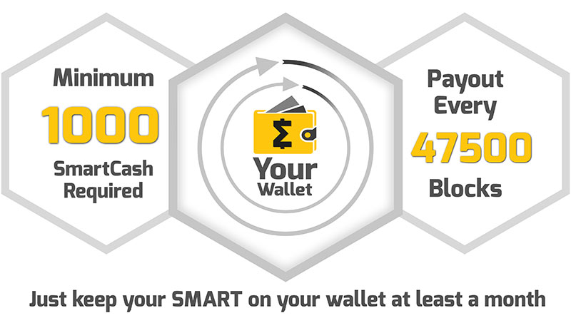

.. meta::
   :description: Information and guides on how to mine the SmartCash cryptocurrency
   :keywords: smartcash, smartreward

.. _smartrewards:

============
SmartRewards
============

In the upcoming 1.3 Phoenix release, one of the major changes will be the introduction of the SuperRewards. SmartRewards has been a way to earn passive income for all SmartCash holders. But now we have added a higher deposit tier that qualifies an address as SuperRewards. The 1.3 release will change block rewards to provide 60% allocation to SmartRewards, helping to effectively distribute incentives to community participants and receive higher rewards.

Users will need to activate each address to start getting SmartRewards or SuperRewards, but the process is simple and fast.

The yearly yield will depend on how long the users hold coins at their addresses. The gif below shows how the estimated yearly yield changes depending on the holding period (1 week, 2 weeks, 3 weeks, 4 weeks). Users will be able to get the maximum yearly yield if they hold the coins for 4 weeks or more. Additionally, users will also be able to receive SuperRewards if they have 1 million or more SMART at one address. SuperRewards will have a higher annual yield. The final rate will depend on how many addresses participate and qualify for the reward. It is worth to noticing that this will be significantly higher than the current percentage, since the rewards allocation is increased and only activated non SmartNode addresses are eligible for SmartRewards.
The updated SmartRewards will allow to earn passive income every week.

Activation process

In a local wallet (Node Client), users simply need to open SmartRewards tab and then click on the “Send ActivateRewards”  button to activate the address. Next to each address will be indicated whether the address is activated or not.

The whole process will take a few seconds.

Some third party wallets like, the Ellipal wallet, will offer the same convenience of an activation button. Any mobile or 3rd party wallet can activate by simply sending a “send all” or “send available” transaction back to the same address used to deposit funds.

SmartRewards FAQ’S
------------------

