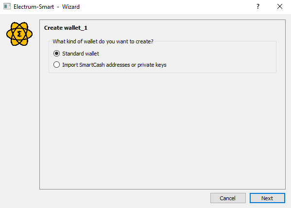
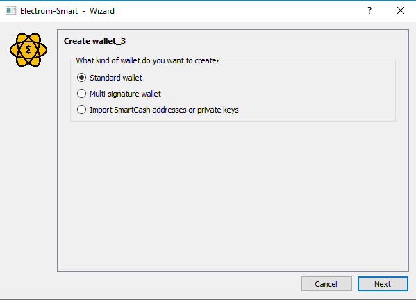
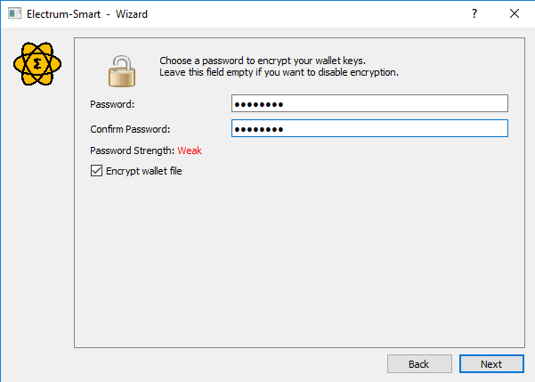

.. meta::
   :description: How to install and create a new SmartCash Electrum wallet on Windows, Linux, macOS
   :keywords: smartcash, mobile, wallet, electrum, linux, windows, macos, installation, compile

.. _electrum-installation:

============
Installation
============

Download
========

You can download SmartCash Electrum from the official SmartCash website.

- https://smartcash.cc/wallets/#electrum
- https://github.com/SmartCash/electrum-smart/releases

You can optionally verify the integrity of your download by running the
following commands (example for Linux)::

  wget https://github.com/SmartCash/electrum-smart/releases/download/v4.0.1/Linux.electrum-smart-4.0.1.tar.gz
  sha256sum https://github.com/SmartCash/electrum-smart/releases/download/v4.0.1/Linux.electrum-smart-4.0.1.tar.gz
  

Linux
-----

SmartCash Electrum for Linux is available from a PPA for Ubuntu and Linux
Mint, and as a source tarball for other systems. As of version 4.0, it
requires Python 3 to run. Enter the following commands to install from
PPA::

    sudo add-apt-repository ppa:smartcash/electrum-smart
    sudo apt update
    sudo apt install electrum-smart

Enter the following commands (changing the version number to match the
current version as necessary) in the terminal to install SmartCash Electrum
from the source tarball::

    sudo apt-get install python3-setuptools python3-pyqt5 python3-pip && sudo pip3 install
    wget https://github.com/SmartCash/electrum-smart/releases/download/v4.0.1/Linux.electrum-smart-4.0.1.tar.gz
    tar -zxvf Linux.electrum-smart-4.0.1.tar.gz
    cd electrum-smart-4.0.1
    sudo python3 setup.py install

macOS
-----

Simply download and run the DMG file. You may need to grant permission
to install, depending on your security settings. Click through the installation wizard and run SmartCash Electrum from your Applications folder when complete.

Windows
-------

Simply download and run the installer file to set up SmartCash Electrum. You may need to grant permission to install, depending on your security
settings. Click through the installation wizard and run SmartCash Electrum
from the Start menu when complete.

Creating a New Wallet
=====================

SmartCash Electrum gathers configuration data when run for the first time.
For more on the concepts behind this process, skip to the later sections
of this guide discussing backups, security, and addresses. When setting
up SmartCash Electrum for the first time, a wizard will guide you through the
process of creating your first wallet. The first screen asks how you
would like to connect to the remote server. Select **Auto connect** and
click **Next** to continue. You will see a notice that no wallet
currently exists. Enter a name for your wallet (or accept the default
name) and click **Next** to create your wallet.

   Selecting the server and naming your first wallet

You will be asked what kind of wallet you want to create. Choose between
**Standard wallet**, **Multi-signature wallet** and **Import SmartCash addresses or private keys**. If you are unsure, select **Standard wallet** and click
**Next** to continue. You will then be asked how you want to
store/recover the seed. If stored safely, a seed can be used to restore
a lost wallet on another computer. Choose between **Create a new seed**,
**I already have a seed**, or **Use a
hardware device**. If you are using Electrum SmartCash for the first time and
not restoring an existing wallet, choose **Create a new seed** and click
**Next** to continue.

.. figure:: img/seed-type.png
   :width: 400px

   Selecting the wallet type and keystore

Electrum SmartCash will generate your wallet and display the recovery seed.
Write this seed down, ideally on paper and not in an electronic format,
and store it somewhere safe. This seed is the only way you can recover
your wallet if you lose access for any reason. To make sure you have
properly saved your seed, Electrum SmartCash will ask you to type it in as a
confirmation. Type the words in the correct order and click **Next** to
continue.

.. image:: img/seed-generate.png
   :width: 400px

.. figure:: img/seed-confirm.png
   :width: 400px

   Generating and confirming the recovery seed

A password optionally secures your wallet against unauthorized access.
Adding a memorable, strong password now improves the security of your
wallet by encrypting your seed from the beginning. Skipping encryption
at this point by not selecting a password risks potential theft of funds
later, however unlikely the threat may be. Enter and confirm a password,
ensure the **Encrypt wallet file** checkbox is ticked and click **Next**
to continue.

   Entering and confirming a wallet encryption password

Your SmartCash Electrum wallet is now set up and ready for use.

.. figure:: img/electrum.png
   :width: 400px

   SmartCash Electrum after setup is complete
