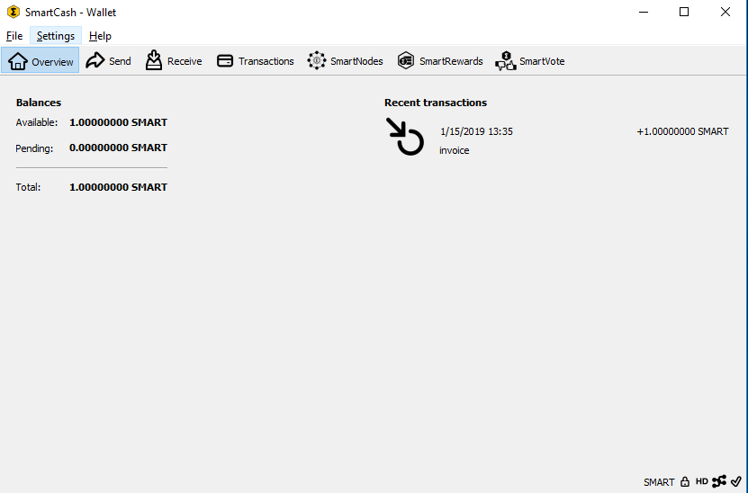
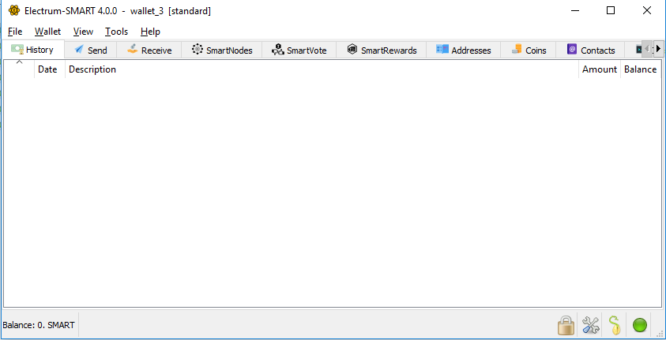
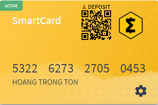
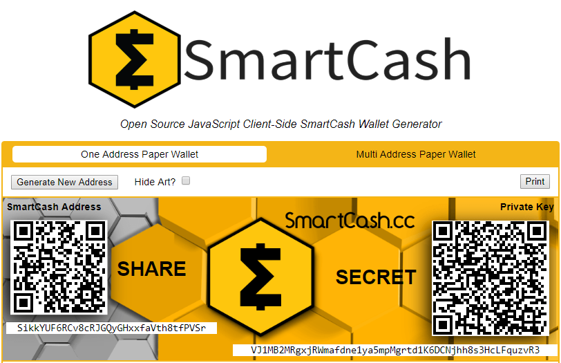
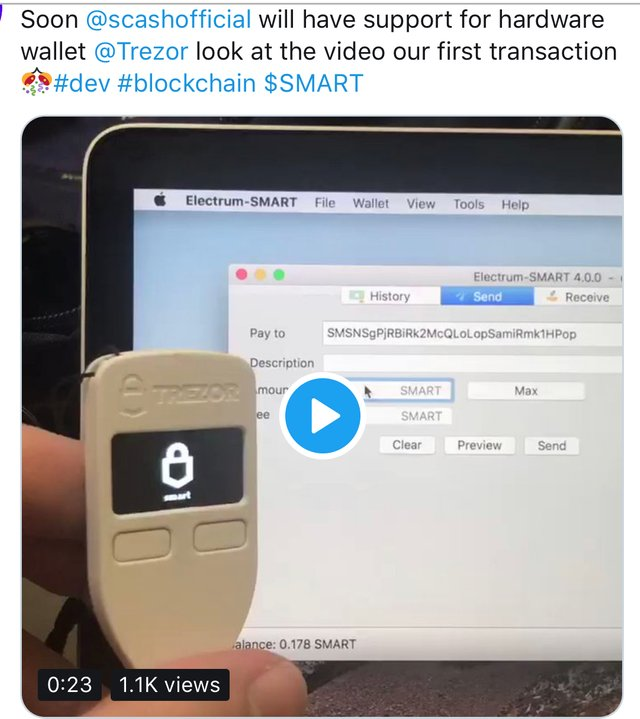
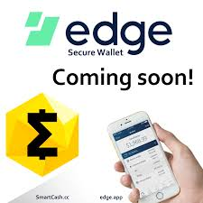

.. meta::
   :description: Description of different wallets available to use and spend SmartCash cryptocurrency
   :keywords: smartcash, wallet, nodeclient, electrum, android, ios, paper, hardware, trezor, ledger, web, recovery, text, sms

.. _wallets:

=======
Wallets
=======

Whenever you are storing objects with a market value, security is
necessary. This applies to barter systems as well as economies using
currency as a medium of exchange. While banks store balances on a
private ledger, cryptocurrencies store balances under unique addresses
on a distributed public ledger. The cryptographic private keys to access
the balance stored on each public address are therefore the object of
value in this system. This section of the documentation discusses
different practical methods of keeping these keys safe in wallets, while
still remaining useful for day-to-day needs.

For safety, it is not recommended to store significant funds on
exchanges or software wallets. If you are holding cryptocurrency worth
more than the device you use to store it, you should purchase a
:ref:`hardware wallet <hardware-wallets>`.

.. _nodeclient-wallet:

SmartCash NodeClient Wallet
============================

SmartCash NodeClient Wallet is the full official release of SmartCash, and supports all
SmartCash features as they are released, including InstantPay and
SmartNodes, as well as an RPC console and Voting features. SmartCash
NodeClient Wallet (sometimes known as the QT wallet, due to the QT software
framework used in development) is a professional or heavy wallet which
downloads the full blockchain (several GB in size) and can operate as
both a full node or smartnode on the network. Because of the
requirement to hold a full copy of the blockchain, some time is required
for synchronisation when starting the wallet. Once this is done, the
correct balances will be displayed and the functions in the wallet can
be used. SmartCash NodeClient Wallet is available for macOS, Linux, Raspberry Pi
and Windows.

Features:

-  InstantPay
-  Wallet encryption
-  Coin control and fee control
-  QR code generation and address book
-  smartnode commands and voting
-  Automated backup
-  Debug console

Available documentation:

.. toctree::
   :maxdepth: 1

   nodeclient/installation.rst
   nodeclient/interface.rst
   nodeclient/send-receive.rst
   nodeclient/instantpay.rst
   nodeclient/backup.rst
   nodeclient/cmd-rpc.rst
   nodeclient/advanced.rst

   SmartCash NodeClient Wallet

.. _smartcash-electrum-wallet:

SmartCash Electrum Wallet
=========================

SmartCash Electrum is a light wallet which uses powerful external servers to
index the blockchain, while still securing the keys on your personal
computer. Transactions are verified on the SmartCash blockchain using a
technique called Secure Payment Verification (SPV), which only requires
the block headers and not the full block. This means that wallet startup
is almost instant, while still keeping your funds secure and mobile. It
does not currently support advanced InstantPay features.

SmartCash Electrum is a fork of the Electrum wallet for Bitcoin. While this
documentation focuses on using SmartCash Electrum, full documentation of all
Bitcoin Electrum features (mostly identical in SmartCash Electrum) is
available at the `official documentation site
<http://docs.electrum.org>`_.

.. toctree::
   :includehidden:
   :maxdepth: 1

   electrum/installation.rst
   electrum/send-receive.rst
   electrum/security.rst
   electrum/faq.rst
   electrum/advanced.rst

   SmartCash Electrum Wallet

.. _smartcash-android-wallet:

SmartCash Android Wallet
========================

SmartCash offers wallet for Android, this is the mobile versions of web wallet so have all features of web wallet.

https://play.google.com/store/apps/details?id=cc.smartcash.wallet

*SmartCash Android Wallet*

.. _smartcash-ios-wallet:

SmartCash iOS Wallet
====================

SmartCash offers wallet for iOS, this is the mobile versions of web wallet so have all features of web wallet.

https://itunes.apple.com/us/app/smartcash-wallet/id1438215565?mt=8

*SmartCash iOS Wallet*

.. _smartcash-smartcard-wallet:

SmartCash smartcard Wallet
==========================

FUTURE POTENTIAL OF SMARTCARD…
Debit and credit card payments have arguably become the dominant way for many to carry out most, if not all, of their daily transactions. Adoption of card payments became increasingly simple for smaller businesses, and now quick and affordable smartphone-powered solutions are already a reality.
SmartCard emerged offering to solve many of the problems facing traditional systems. SmartCard  is blockchain-based solution that aims to improve on the digital payment card model. Our main goals are to streamline crypto transactions and make them practical for use in real-life payment scenarios. At the same time, we aim to drastically reduce fees and confirmation time frames over those found in current solutions. 

SOLVING MAJOR CHALLENGES WITH A SIMPLE SOLUTION
As they currently stand, both traditional cards and crypto payment solutions leave a lot to be desired. Transaction fees of over 3% for some cards can add up to substantial losses over time for businesses of all sizes. For even small businesses, it’s normal for more than $50,000 a year to be lost in processing fees.

In addition to this, both buyers and sellers must have access to major banks and their services in order to facilitate these types of transactions; a major problem in many parts of the world. Also, traditional services inherently have long confirmation times of up to several days, which can themselves lead to other issues. Cryptocurrencies have indeed proposed solutions to many of these challenges, as it is easy to find many projects today that offer instant transactions and virtually no fees. But, this doesn’t change the fact that using this new technology in its current form is like trying to send an email in the 80s – too time-consuming to setup and operate to be practical for most everyday applications.

Using their new feature called the SmartCard, the developers of SmartCash are looking to improve upon and/or eliminate entirely the present limitations of payment cards. SmartCard is the crypto alternative to the debit card which uses the SmartCash blockchain to easily initiate and verify transactions of any size and frequency. As with many other cryptocurrencies, the fees are right around 0%; it costs just fractions of a cent to process a transaction, regardless of the amount. The payments will be instantly confirmed at the time of purchase, meaning there is no delay between authorization of the payment and the transfer of the actual funds.

In a way, the purchases made with SmartCard combine the best of cash, card, and crypto payments. The funds are moved between parties instantly, like cash, but the transaction is authorized by the buyer with a simple code that can be either digitally stored on a smartphone or printed and carried separately as a physical QR code. This makes the payment process just as convenient as regular card payments, and far easier than having to send cryptocurrency manually from a mobile app.

HOW IT ALL WORKS
There are just two main applications: the card app for the consumer and the Point of Sale (PoS) app for the merchant.

The card app allows anyone to create a SmartCard with just a few taps. Each card has an associated public address which can be used to load more funds onto the card from any wallet or exchange that offers SmartCash. Also included into each one is a QR code which can be scanned by the PoS application from either a phone screen or from a simple piece of paper. Once loaded through this address, the card works very similar to a pre-paid debit card.

The PoS app is equally responsible for this convenience. The merchant only has to specify the transaction amount in the local currency, and the app automatically initiates a transaction in the equivalent amount of SmartCash. The merchant uses the app to scan the code and requests the buyer to enter a confirmation pin. After entering it on the merchant’s smartphone, the app connects to the blockchain to submit the transaction. If the code and pin match, and there are enough funds in the card address, the transaction is instantly verified and recorded on the blockchain. The process of scanning a card and entering a pin to confirm is already well familiar to current debit card users, and so it would be easy for everyone to get used to.

A REVOLUTIONARY PAYMENT SYSTEM EVERYONE CAN LOVE
This ease of use and familiarity present the key advantage of this system over other crypto payments, which require both parties to be online for a transaction. Once the card is created and loaded, only the merchant is responsible for having a live connection to the internet and the consumer can take the funds anywhere without worrying about a dead battery or lack of signal in remote areas. No need for fumbling with mobile wallet apps, nor any memorization beyond the simple numerical pin just like the ones used for debit purchases. In addition to this, it also offers the advantage of being usable in places where traditional banking services are only partially available, or even absent entirely. Whereas other mobile payment solutions require bank accounts for both parties to send/receive the funds, this one uses the SmartCash blockchain instead and is thus accessible to anyone who wishes to use it.

Naturally, these benefits would also be quite attractive to buyers and sellers in more developed nations as well. Other crypto solutions fall somewhat short of their promises. Crypto debit cards suffer from the same fees and transaction delays as any other current plastic card, and sending money through current mobile wallets requires a lot of time and effort to make the payments. Compared to these options, SmartCard payments are in a league of their own in convenience and speed. Add to this the fact that the SmartCash community is actively seeking, recruiting, and sponsoring business owners and entrepreneurs globally, and it is easy to imagine how the SmartCard could increasingly gain global adoption across a wide range of markets and economies.

.. toctree::
   :maxdepth: 1

   smartcard/getting-started.rst
  

*SmartCash smartcard Wallet*

.. _paper-wallets:

SmartCash Paper Wallet
======================

The `SmartCash Paper Wallet generator <https://paperwallet.smartcash.cc/>`_ allows you
to generate, encrypt and secure the keys to a single SmartCash address on a
clean computer without ever connecting to the internet. Perfect for long
term secure storage.

.. toctree::
   :maxdepth: 1

   paper.rst

   SmartCash Paper Wallet

.. _hardware-wallets:

Hardware Wallets
================

A hardware wallet is a type of device which stores private keys for a
blockchain in a secure hardware device, instead of in a database file
such as wallet.dat used with common software wallets. This offers major
security advantages over software wallets, as well as practical benefits
over paper wallets. To date, there is no verifiable evidence of hardware
wallets being compromised by viruses, and they are also immune to
keylogger attacks that could be used to steal passwords to unlock the
private keys used with software wallets.

Hardware wallets function by storing your private keys in a protected
area of a microcontroller. It is impossible for the private key to leave
the device in plain text - only the signed output of the cryptographic
hash is ever transmitted to the device interacting with the blockchain,
such as your computer or smartphone. Most hardware wallets feature a
screen which allows you to independently confirm the address you are
sending to is correct.

This section lists the most common commercial hardware wallets supporting
SmartCash, although some other enthusiast projects may also be available.

.. toctree::
   :maxdepth: 1

   hardware.rst

   Trezor and Electrum SmartCash Wallet

.. _third-party-wallets:

Third Party Wallets
===================

These wallets have been developed by external developers to support
SmartCash. Many third party wallets support multiple different
cryptocurrencies at the same time, or integrate instant cryptocurrency
exchanges.

.. toctree::
   :maxdepth: 1

   third-party.rst

   Edge Wallet

.. _web-wallets:

Web Wallets
===========

https://wallet.smartcash.cc/, which provides a
secure web interface to the SmartCash blockchain while leaving you with full
control of your private keys.

.. toctree::
   :maxdepth: 1

   web.rst

.. figure:: img/web-wallet.png
   :width: 400 px

   My SmartCash Wallet

Wallet Guides
=============

Documentation in this section describes common tasks and questions
relating to all wallets.

.. toctree::
   :maxdepth: 1

   recovery.rst
   signing.rst
