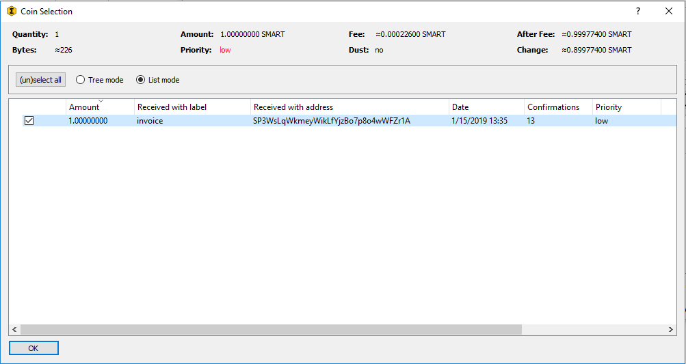
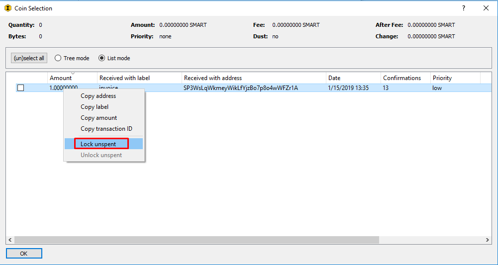
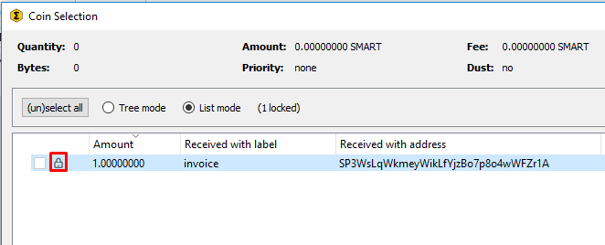
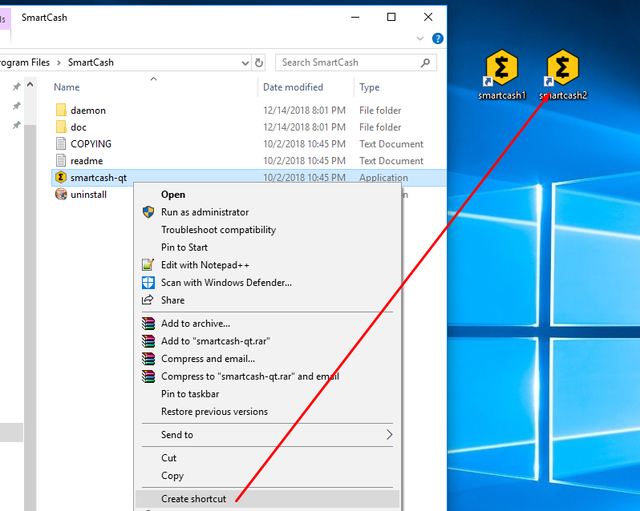
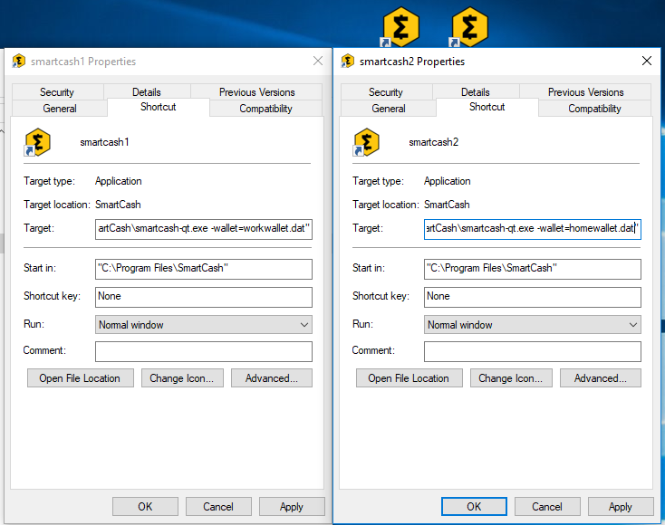
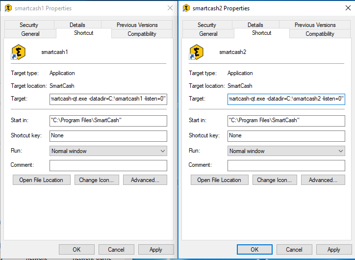
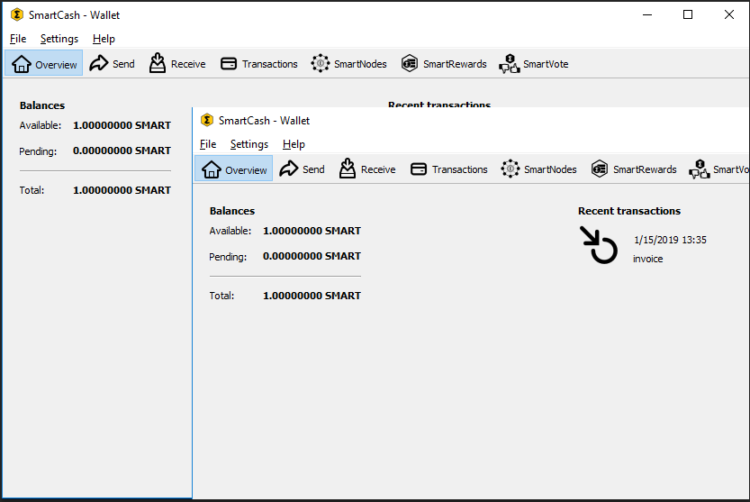

.. meta::
   :description: Coin control, HD wallets, multisig, KeePass and multiple wallet files using the SmartCash NodeClient wallet
   :keywords: smartcash, core, wallet, backup, restore, wallet.dat, hd, seed, passphrase, mnemonic, coin control, hierarchical deterministic

.. _nodeclient-advanced:

===============
Advanced topics
===============

.. _coin-control:

Coin Control
============

Coin Control allows users of the SmartCash NodeClient Wallet to specify which
addresses and Unspent Transaction Outputs (UTXOs) should be used as
inputs in transactions. This allows you to keep a specific balance on
certain addresses in your wallet, while spending others freely. In smartcash
NodeClient Wallet, click **Settings > Options > Wallet > Enable coin control
features**. Now, when you go to the Send tab in your wallet, a new
button labelled **Inputs…** will appear. Click this button to select
which UTXOs can be used as input for any transactions you create. The
following window appears:

   Coin Selection window in SmartCash NodeClient wallet, showing two smartnodes
   (testnet)

Right click on the transaction(s) you do not want to spend, then select
**Lock unspent**. A small lock will appear next to the transaction. You
can click the **Toggle lock state** button to invert the locked/unlocked
state of all UTXOs. When you are ready to continue, click **OK**. You
can now safely create transactions with your remaining funds without
affecting the locked UTXOs.

   Locking UTXOs in SmartCash NodeClient wallet

.. _nodeclient-hd:

HD Wallets
==========

Since version v1.2.3, SmartCash NodeClient has included an implementation of
BIP39/BIP44 compatible hierarchical deterministic (HD) key generation.
This functionality is only available from the command line by specifying
the ``usehd`` option when starting SmartCash NodeClient for the first time. Use
this function with care, since the mnemonic seed and keys will be stored
in plain text until you specify a wallet passphrase. Note that the
wallet passphrase is different to the mnemonic passphrase, which is
often also referred to as the "25th word" or "extension word". The
wallet passphrase encrypts the wallet file itself, while the mnemonic
passphrase is used to specify different derivation branches from the
same mnemonic seed.

We will use the Windows GUI wallet in this example, but the commands are
similar if using ``smartcash-qt`` or ``smartcashd`` on other operating systems.
Enter the following command to get started with a randomly generated HD
wallet seed and no mnemonic passphrase::

  smartcash-qt.exe --usehd=1

A new HD wallet will be generated and SmartCash NodeClient will display a warning
informing you that you must encrypt your wallet after verifying it works
correctly. Open the console from **Help -> Debug Windows - >Consolse tab** or issue the
following RPC command from ``smartcash-cli`` to view the mnemonic seed::

  dumphdinfo

SmartCash NodeClient will display the HD seed in both hexadecimal and as a BIP39
mnemonic. To restore an existing HD wallet, or define your own
separately generated mnemonic and/or passphrase, ensure no
``wallet.dat`` file exists in the ``datadir`` and enter the following
command::

  smartcash-qt.exe --usehd=1 --mnemonic="enter mnemonic" --mnemonicpassphrase="optional mnemonic passphrase"

The HD wallet will be restored and your balance will appear once sync is
complete.

Multiple wallets
================

It is possible to select between different smartcash wallets when starting
SmartCash NodeClient by specifying the ``wallet`` argument, or even run multiple
instances of SmartCash NodeClient simultaneously by specifying separate data
directories using the ``datadir`` argument.

To begin, install the SmartCash NodeClient wallet for your system according to the
:ref:`installation instructions <nodeclient-installation>`. When you get
to the step **Running SmartCash NodeClient for the first time**, you can decide
whether you want to maintain separate ``wallet.dat`` files in the
default location (simpler if you do not need to run the wallets
simultaneously), or specify entirely separate data directories such as
e.g. ``C:\smartcash1`` (simpler if you do want to run the wallets
simultaneously).

Separate wallet.dat files
-------------------------

For this scenario, we will create two shortcuts on the desktop, each
using a different wallet file. Navigate to the binary file used to start
SmartCash NodeClient (typically locatd at ``C:\Program Files\smartcash\smartcash-qt.exe``
or similar) and create two shortcuts on the desktop. Then open the
**Properties** window for each of these shortcuts.

   Creating desktop shortcuts using Windows 10

Modify the **Target** property of each shortcut to point to a different
wallet file by specifying the ``wallet`` argument when starting the
wallet. If you do not specify a ``wallet`` argument, ``wallet.dat`` will
be used by default. The specified wallet file will be created if it does
not exist. The following example demonstrates two wallets named
``workwallet.dat`` and ``homewallet.dat``:

- Wallet Target 1: ``"C:\Program Files\smartcash\smartcash-qt.exe" -wallet=workwallet.dat``
- Wallet Target 2: ``"C:\Program Files\smartcash\smartcash-qt.exe" -wallet=homewallet.dat``

   Specifying separate wallet files

You can now use the two icons to quickly and easily open different
wallets from your desktop. Note that you cannot open both wallets
simultaneously. To do this, you will need two separate data directories,
as described below.

Separate data directories
-------------------------

Start SmartCash NodeClient and allow it to synchronize with the network, then close
SmartCash NodeClient again. You can now create two directories at e.g. ``C:\smartcash1``
and ``C:\smartcash2`` and copy the ``blocks`` and ``chainstate`` directories
from the synchronized data directory into the new directories. Each of
these will serve as a separate data directory, allowing you to run two
instances of SmartCash NodeClient simultaneously. Create two (or more) shortcuts on
your desktop as described above, then specify arguments for ``datadir``
as shown below:

- Datadir Target 1: ``"C:\Program Files\nodeclient\smartcash-qt.exe" -datadir=C:\smartcash1 -listen=0``
- Datadir Target 2: ``"C:\Program Files\nodeclient\smartcash-qt.exe" -datadir=C:\smartcash2 -listen=0``

   Specifying separate datadirs

You can now use the two icons to quickly and easily open different
wallets simultaneously from your desktop. Both wallets maintain separate
and full copies of the blockchain, which may use a lot of drive space.
For more efficient use of drive space, consider using an SPV or "light"
wallet such as :ref:`smartcash Electrum <electrum-wallet>` to maintain
multiple separate wallets without keeping a full copy of the blockchain.

   Two instances of SmartCash NodeClient running simultaneously
