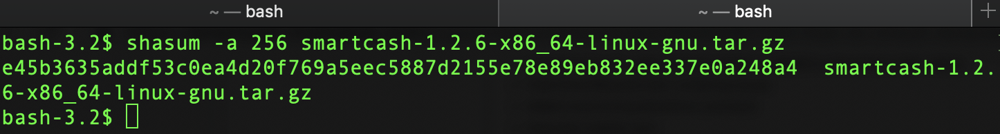

.. meta::
   :description: How to download, install and encrypt the SmartCash NodeClient wallet in Linux
   :keywords: smartcash, nodeclient, wallet, linux, ubuntu, installation

.. _nodeclient-installation-linux:

Linux Installation Guide
========================

This guide describes how to download, verify, install and encrypt the
SmartCash NodeClient wallet for Linux. The guide is written for Ubuntu 16.04 LTS,
but the steps should be similar for other Linux distributions.

Downloading the SmartCash NodeClient wallet
-------------------------------------------

Visit https://smartcash.cc/wallets/#nodeclient to download the latest SmartCash NodeClient
wallet.If you are unsure whether your version of Linux is 32 or 64 bit, you can check in
Ubuntu under the **System menu > About This Computer**. For details on
how to check this in other versions of Linux, see
`here <https://www.howtogeek.com/198615/how-to-check-if-your-linux-system-is-32-bit-or-64-bit/>`__.

Once you know which version you need, download SmartCash NodeClient to your
computer from `https://smartcash.cc/wallets/#nodeclient <https://smartcash.cc/wallets/#nodeclient>`__.

   Manually selecting and downloading SmartCash NodeClient

Save the file you downloaded to your Downloads folder.

Verifying SmartCash NodeClient
------------------------------

This step is optional, but recommended to verify the integrity of the
file you downloaded. This is done by checking its SHA256 hash against
the hash published by the SmartCash NodeClient development team.

Once the SmartCash NodeClient file,
view hash in your browser and find the hash
value for the SmartCash NodeClient file you downloaded.

This hash value should correspond with the hash value of the file you
have downloaded to ensure it is authentic and was not corrupted during
transit. To do this, open Terminal, browse to the location where you
saved the file, and run the sha256sum command.

   Generating an SHA256 hash for the downloaded file

If the hashes match, then you have an authentic copy of SmartCash NodeClient for
Linux.

View more here <https://smartcash.freshdesk.com/support/solutions/articles/35000087793>_

Extracting SmartCash NodeClient
-------------------------------

SmartCash NodeClient for Linux is distributed as a compressed archive and not an
installer. This is because this same archive also contains other files
built for running a smartnode on a server, for example. In this guide,
we will extract the executable file with a graphical user interface
(GUI) designed for use by end users as a wallet.

Begin by creating a folder for the SmartCash NodeClient executable file on the
Desktop. Browse to the Desktop (or the location of your choice) and
create the folder.

   Creating a folder on the Desktop
   Renaming the folder to SmartCash

Next, open the archive by double-clicking on it. The Archive Manager
will appear. Browse to the smartcash-1.2.6/bin/ folder and extract the
smartcash-qt file to the SmartCash folder you created on the Desktop by drag and
drop.

To run SmartCash NodeClient for the first time, open Terminal and browse to the
SmartCash folder on the Desktop, or where you chose to extract the file. Type
``./smartcash-qt`` to run the file.

The first time the program is launched, you will be offered a choice of
where you want to store your blockchain and wallet data. Choose a
location with enough free space, as the blockchain can reach 10GB+ in
size. It is recommended to use the default data folder if possible.

SmartCash NodeClient will then start up. This will take a little longer than usual
the first time you run it, since SmartCash NodeClient needs to generate
cryptographic data to secure your wallet.

Synchronizing SmartCash NodeClient to the SmartCash network
--------------------------------------------------------------

Once SmartCash NodeClient is successfully installed and started, you will see the
wallet overview screen. You will notice that the wallet is “out of
sync”, and the status bar at the bottom of the window will show the
synchronization progress.

During this process, SmartCash NodeClient will download a full copy of the SmartCash
blockchain from other nodes to your device. Depending on your internet
connection, this may take a long time. If you see the message “No block
source available”, check your internet connection. When synchronization
is complete, you will see a small blue tick in the lower right corner.

You can now begin to use your wallet to send and receive funds.

Encrypting your SmartCash wallet
---------------------------------

After your wallet has synchronized with the SmartCash network, it is strongly
advised to encrypt the wallet with a password or passphrase to prevent
unauthorized access. You should use a strong, new password that you have
never used somewhere else. Take note of your password and store it
somewhere safe or you will be locked out of your wallet and lose access
to your funds.

To encrypt your wallet, click **Settings** > **Encrypt wallet**.

When the encryption process is complete, you will see a warning that
past backups of your wallet will no longer be usable, and be asked to
shut down SmartCash NodeClient. When you restart SmartCash NodeClient, you will see a small
blue lock in the lower right corner.

Using the Ubuntu Repository to install SmartCash NodeClient
------------------------------------------------------------------

Ubuntu allows you to add third-party repositories to install and update
software using the apt command line utility. SmartCash NodeClient team maintains
such a repository, although the software version included here may be
older than what is available on the website. To install SmartCash NodeClient from
the repository, open the Terminal and enter the following commands::

    sudo add-apt-repository ppa:smartcash/ppa -y && sudo apt update && sudo apt install smartcashd -y 
