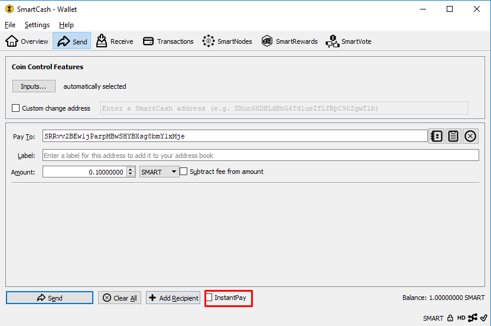

.. meta::
   :description: Using instantpay with SmartCash
   :keywords: smartcash, core, mobile, wallet, instantpay

.. _nodeclient-instantpay:

==========
instantpay
==========

instantpay
==========

Introduction
------------

This documentation describes how to use instantpay to instantly send
funds to any other SmartCash user around the world. SmartCash instantpay is
supported by many wallets and vendors, including (but not limited to)
the following:

- SmartCash Node Client Wallet
- SmartCash Android Wallet
- SmartCash iOS Wallet
- My SmartCash Wallet
- and many more...

You can read more about instantpay theory and processes :ref:`here
<instantpay>`.

Paying with instantpay
-----------------------

instantpay functions by setting a flag on the transaction, causing
deterministic selection of a quorum of 10 smartnodes for each input
spent in an instantpay transaction. The smartnodes examine the input,
and if a majority determines it has at least six confirmations, they
then accept the transaction. The input is then locked until the
transaction has been confirmed in six mined blocks, at which point the
output can be used as an input in another instantpay transaction. This
differs from inputs used in normal transactions, which can be spent
after just one confirmation regardless of whether the SmartCash was received
using instantpay or not. A higher fee will be charged for instantpay
transactions with more than four inputs, according to the :ref:`fee
schedule <fees>`. Note that the receiving wallet must also be aware of
instantpay in order to be able to immediately continue with the
transaction or display an appropriate notification that the transaction
should be considered locked. If the receiving wallet is not aware of
instantpay, it will simply appear as a normal transaction and you will
need to wait for standard block confirmations.

To pay with instantpay, simply check the relevant checkbox in your app.
The following screenshots indicate where this setting can be found in
the SmartCash Node Client wallets.

   SmartCash Wallets showing instantpay option
