.. meta::
   :description: Description of dialogs and interfaces in the SmartCash NodeClient wallet
   :keywords: smartcash, core, wallet, interface, dialog, synchronisation, tools options

.. _nodeclient-interface:

=========
Interface
=========

The SmartCash NodeClient Wallet is an application that runs on your computer and
allows you to make transactions on the SmartCash network. Most transactions
are for sending or receiving SmartCash, but it is also possible to create
signed messages or control a smartnode, for example. The SmartCash NodeClient Wallet
interface is described in detail in the following sections.

The Main Window
===============

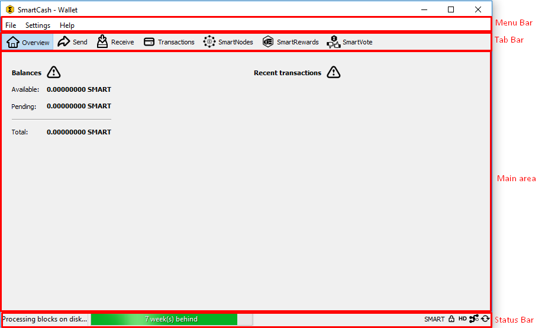

   The SmartCash NodeClient Wallet

The SmartCash NodeClient window is broken up into several areas:

-  The menu bar
-  The tab bar
-  The main area
-  The status bar

The Menu Bar
------------

The menu bar provides access to all functions of SmartCash NodeClient. There are
three menus available:

File
  The File menu is used to manage your wallet, messages and addresses.
Settings
  The Settings menu provides access to wallet encryption options and
  general software settings.
Help
  The Help menu links to Debug Window, documentation SmartCash NodeClient.
   
The Tab Bar
-----------
The tab bar is used to quickly switch between the main areas of the SmartCash
NodeClient. The content in the main area of SmartCash NodeClient changes depending on
which tab you have selected. The following tabs are available:

The Overview tab
~~~~~~~~~~~~~~~~

The overview tab offers quick access to your balance and most recent
transactions.

.. figure:: img/overview.png

   The SmartCash NodeClient Overview tab

The left part of the main area is divided into two areas. The upper area
shows your balances:

Available
  This shows your current liquid balance. This is the amount of SmartCash
  you can spend now.

Pending
  This shows funds waiting for a transaction to complete.

Immature
  This shows funds from smartnode or mining payments which have not
  yet reached the required number of confirmations. 
   
Total
  This is simply your available and pending funds added together.

The right part of the screen shows your recent transactions. These are
identified by icons as follows:

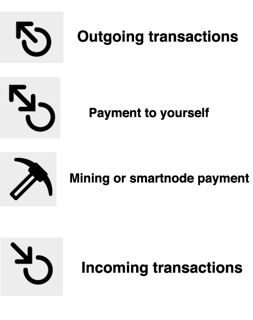

-  Recent incoming transactions appear black, prefixed by a + sign
-  Recent outgoing transactions appear red, prefixed by a – sign
-  Incoming mining or smartnode payments also appear black

For more details on your transaction history, see the Transactions tab.

The Send Tab
~~~~~~~~~~~~~

The Send tab allows you to send funds to another address on the SmartCash
network. It contains fields to enter the recipient’s address, a label
for the address, and the amount of SmartCash you wish to send. Options
related to the transaction fee, InstantPay are also
available. A quick view of your total balance is also available in the
lower right corner.

.. figure:: img/send.png

   The Send tab

The Receive Tab
~~~~~~~~~~~~~~~~

The Receive tab allows you to create addresses to receive SmartCash. You can
create a request for a specific amount of SmartCash or include a specific
message, and send it to another user as a link or QR code.

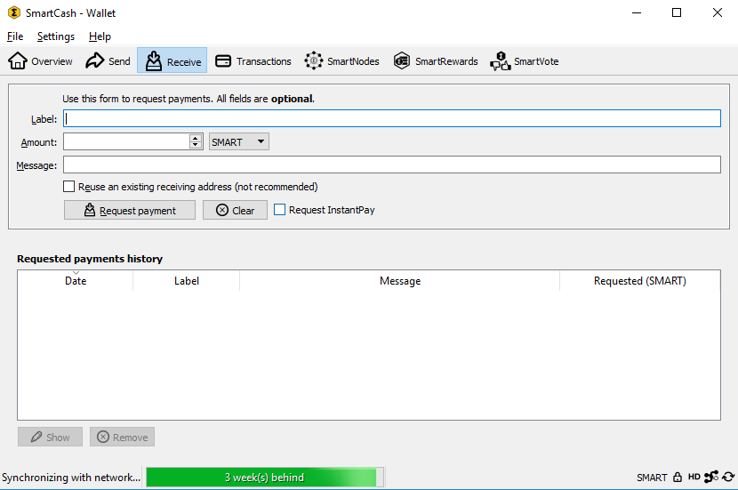

   The Receive tab

The Transactions Tab
~~~~~~~~~~~~~~~~~~~~~~~

The transactions tab shows the entire transaction history for all
addresses associated with your wallet. This appears as a table showing
the time, type, label and amount of SmartCash for each transaction. You can
also export the transaction history as a CSV file by clicking the Export
button in the bottom right corner of the window.

The icons in the leftmost column indicate the status of the transaction.
A tick indicates that the recommended number of confirmations has been
passed, while a clock indicates that the transaction has yet to reach
six confirmations.

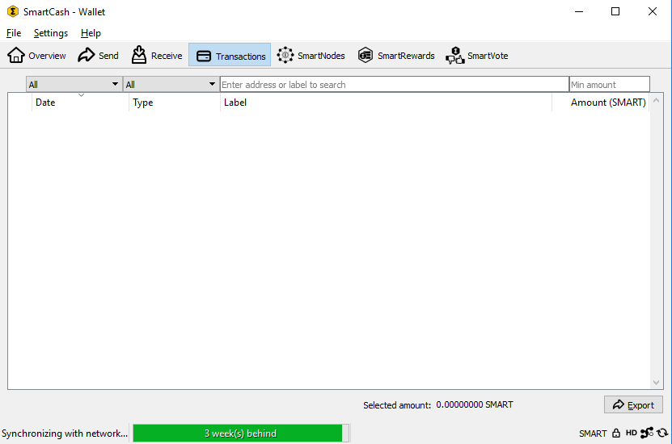

   The transactions tab

The Status Bar
--------------

The status bar shows a synchronization progress bar and a row of status
icons which indicate the status of your connection to the SmartCash network.

The Synchronization Bar
~~~~~~~~~~~~~~~~~~~~~~~

This bar shows the synchronization status of SmartCash NodeClient with the SmartCash
network. Each time you open SmartCash NodeClient, it will begin downloading the
blocks which have been created on the blockchain in the time since you
last opened the app. These blocks are downloaded from other SmartCash users
and smartnodes. If you have never opened the app before, this could
mean several years’ worth of blocks need downloading. The following
statuses are possible:

No block source available
  This occurs if your internet connection is down, or if the ports
  required by SmartCash NodeClient are blocked by a firewall.
Synchronizing with network
  SmartCash NodeClient is downloading blocks from the network.
Synchronizing smartnodes/smartnode smartreward/smartvote objects
  SmartCash NodeClient is synchronizing other data with the second layer network.

Once synchronization is complete, the progress bar will disappear and a
tick will appear on the right of the status bar.

The Status Icons
~~~~~~~~~~~~~~~~~~~~~~~

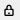

The lock icons indicate the status of your wallet: either
locked or unlocked. You need to unlock your wallet to send funds or
perform certain other actions.

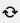

These icons show the synchronization status of SmartCash NodeClient with
the network. Once synchronization is complete, the refresh icon will
become a blue tick.

These icons indicate whether your wallet is running in hierarchical 
deterministic (HD) mode or standard mode.

The Options Dialog
==================

This documentation describes the functionality of the SmartCash NodeClient Options
dialog, available under the **Settings > Options** menu in SmartCash NodeClient.

Main tab
---------

The Main tab of the Options dialog contains settings related to startup
and performance of the SmartCash NodeClient app.

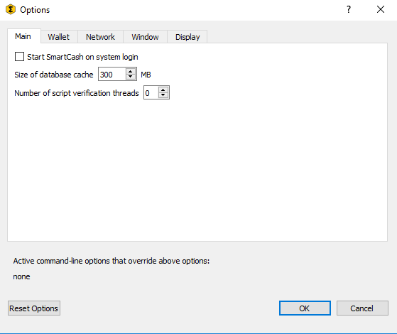

   The Main tab of the SmartCash NodeClient Options dialog

Start SmartCash NodeClient on system login
  This option causes SmartCash NodeClient to start automatically when the current
  user logs in. On most computers there is only one main user account
  which is logged in automatically when the computer turns on, so this
  option is effectively the same as starting SmartCash NodeClient together with the
  operating system.
Size of database cache
  This option specifies the size of the database cache in memory. A higher
  value will result in increased performance when adding new blocks at the
  cost of higher memory usage. The default value is 300MB and it should
  not be set lower than this level.
Number of script verification threads
  This option sets the number of script verification threads, ranging from
  -4 to 16. `Script verification <https://en.bitcoin.it/wiki/Script>`__ is
  the process of following instructions recorded in the blockchain to
  ensure the transactions are valid. 0 means automatic and will allow
  script verification to scale to the number of cores available on your
  processor. Setting a positive number specifies that SmartCash NodeClient should use
  that number of processor cores, while setting a negative number will
  leave that number of processor cores free.

Wallet tab
----------

The Wallet tab of the Options dialog contains settings related to how
addresses are managed in the SmartCash NodeClient app. This tab allows you to configure how these addresses are used
as inputs with the Coin Control.

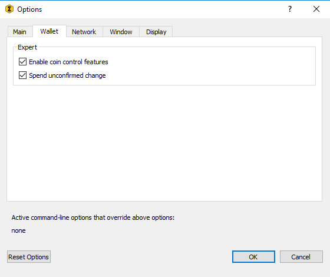

   The Wallet tab of the SmartCash NodeClient Options dialog

Enable coin control features
  Your SmartCash NodeClient wallet balance is actually the sum total of all
  addresses holding balance that are associated with your wallet. When
  you spend SmartCash, SmartCash NodeClient will withdraw from as many inputs as
  necessary to make up the desired amount of SmartCash to be transferred.
  This behavior may be undesirable if you want to keep a certain balance
  on one address. The most common use case is the requirement to
  maintain 10000 SmartCash on a single address as collateral for a smartnode.
  Enabling this option will add a button labelled **Inputs** on the
  **Send** tab. This provides access to the **Coin selection** dialog,
  which can be used to lock, unlock and prioritize different addresses
  in your wallet. See :ref:`here <coin-control>` for a more detailed
  explanation of Coin Control.

Spend unconfirmed change
  When this option is enabled, the SmartCash NodeClient wallet permits you to
  immediately spend change from previous transactions that has been
  transferred internally between addresses associated with the same
  wallet. This is possible even if the transaction has not yet been
  confirmed because the wallet knows it will eventually be confirmed since
  it created the internal transaction itself. Leaving this option enabled
  allows you to create new transactions even if previous transactions have
  not yet been confirmed.

Network tab
-----------

This tab includes options related to how your connection to the SmartCash
network is made.

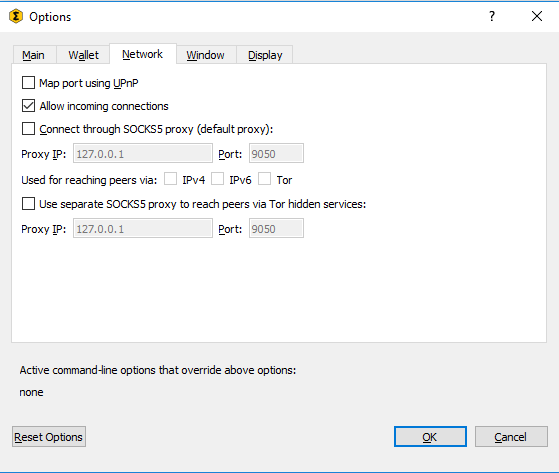

   The Network tab of the SmartCash NodeClient Options dialog

Map port using UPnP
  This option causes SmartCash NodeClient to automatically attempt to open and map
  the client port on your router using
  `UPnP <https://en.wikipedia.org/wiki/Universal_Plug_and_Play>`__
  (Universal Plug and Play). This feature is supported by most modern home
  routers and will allow you to connect to the SmartCash network without making
  any special settings on your router.

Allow incoming connections
  This option causes your client to accept external connections. Since
  SmartCash is a peer-to-peer network and SmartCash NodeClient is considered a full client
  because it stores a copy of the blockchain on your device, enabling this
  option helps other clients synchronize the blockchain and network
  through your node.

Connect through SOCKS5 proxy (default proxy)
  These options allow users on an intranet requiring a proxy to reach the
  broader internet to specify the address of their proxy server to relay
  requests to the internet. Contact your system administrator or check out
  the network settings in your web browser if you are unable to connect
  and suspect a proxy may be the source of the problem.

Use separate SOCKS5 proxy to reach peers via Tor hidden services
  These options allow you to specify an additional proxy server designed
  to help you connect to peers on the Tor network. This is an advanced
  option for increased privacy and requires a Tor proxy on your network.
  For more information about Tor, see
  `here <https://www.torproject.org/>`__.

Window tab
-----------

This option contains options governing behavior of the SmartCash NodeClient app
window under Microsoft Windows.

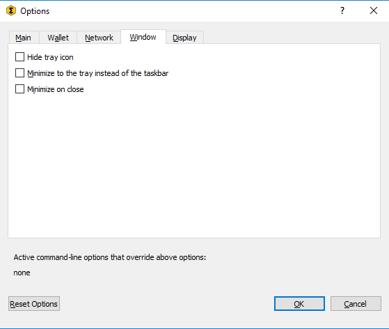

   The Window tab of the SmartCash NodeClient Options dialog

Hide tray icon
  When this option is enabled, SmartCash NodeClient will not display an icon in the
  system tray. This option cannot be selected at the same time as
  **Minimize to the tray instead of the taskbar**.

Minimize to the tray instead of the taskbar
  When this option is enabled and the SmartCash NodeClient window is minimized, it
  will no longer appear in your taskbar as a running task. Instead, SmartCash
  Core will keep running in the background and can be re-opened from the
  SmartCash icon in the system tray (the area next to your system clock). This
  option cannot be selected at the same time as **Hide tray icon**.

Minimize on close
  When this option is enabled, clicking the X button in the top right
  corner of the window will cause SmartCash NodeClient to minimize rather than close.
  To completely close the app, select **File > Exit**.
  
Display tab
------------

This tab contains options relating to the appearance of the SmartCash NodeClient
app window.

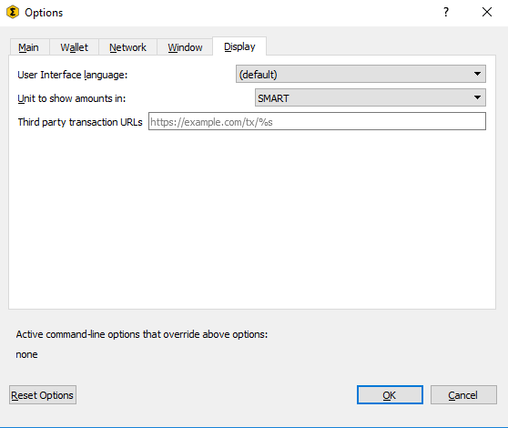

   The Display tab of the SmartCash NodeClient Options dialog

User interface language
  Select your preferred language from this drop-down menu. Changing the
  language requires you to restart the SmartCash NodeClient app.

Unit to show amounts in
  This allows you to change the default unit of currency in SmartCash NodeClient from
  SmartCash to mSmartCash, µSmartCash or duffs. Each unit shifts the decimal separator
  three places to the right. Duffs are the smallest unit into which SmartCash
  may be separated.

Third party transaction URLs
  This option allows you to specify and external website to inspect a
  particular address or transaction on the blockchain. Several blockchain
  explorers are available for this. To use this feature, enter the URL of
  your favorite blockchain explorer, replacing the %s with the transaction
  ID. You will then be able to access this blockchain explorer directly
  from SmartCash NodeClient using the context menu of any given transaction.   

The Tools Dialog
================

This documentation describes the functionality of the SmartCash NodeClient Tools
dialog, available under the **Help ==> Debug Window** menu in SmartCash NodeClient.

Information tab
---------------

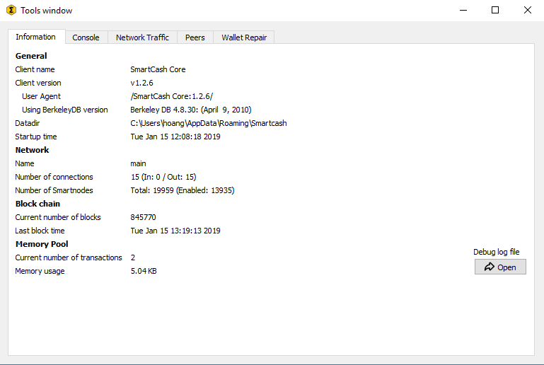

   The Information tab of the SmartCash NodeClient Tools dialog

General
  This section displays information on the name and version of the client
  and database, and the location of the current application data
  directory.

Network
  This section displays information and statistics on the network to which
  you are connected.

Block chain
  This section shows the current status of the blockchain.

Memory pool
  This section shows the status of the memory pool, which contains
  transactions that could not yet be written to a block. This includes
  both transactions created since the last block and transactions which
  could not be entered in the last block because it was full.

Open debug log file
  This button opens debug.log from the application data directory. This
  file contains output from SmartCash NodeClient which may help to diagnose errors.

Console tab
-----------

The Console tab provides an interface with the SmartCash NodeClient RPC (remote
procedure call) console. This is equivalent to the ``smartcash-cli`` command
on headless versions of SmartCash, such as ``smartcashd`` running on a smartnode.
Click the red ``–`` icon to clear the console, and see the detailed
documentation on RPC commands to learn about the possible commands you can 
issue.

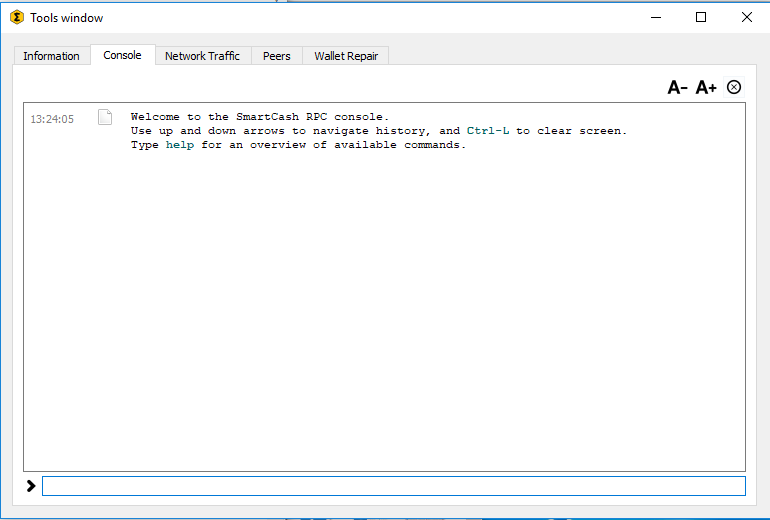

   The Console tab of the SmartCash NodeClient Tools dialog

Network Traffic tab
-------------------

The Network Traffic tab shows a graph of traffic sent and received to
peers on the network over time. You can adjust the time period using the
slider or **Clear** the graph.

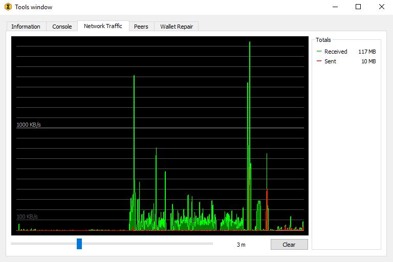

   The Network Traffic tab of the SmartCash NodeClient Tools dialog

Peers tab
---------

The Peers tab shows a list of other full nodes connected to your SmartCash
Core client. The IP address, version and ping time are visible.
Selecting a peer shows additional information on the data exchanged with
that peer.

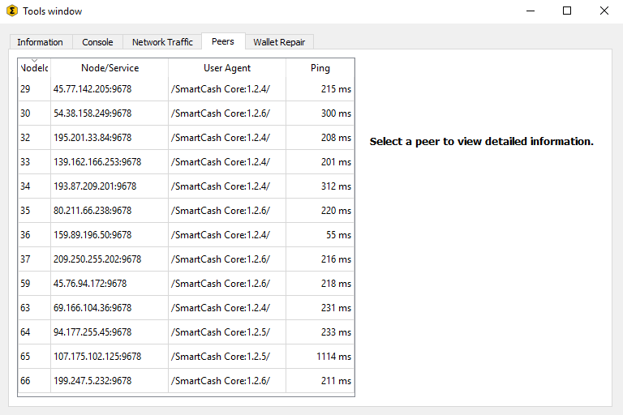

   The Peers tab of the SmartCash NodeClient Tools dialog

Wallet Repair tab
-----------------

The Wallet Repair tab offers a range of startup commands to restore a
wallet to a functional state. Selecting any of these commands will
restart SmartCash NodeClient with the specified command-line option.

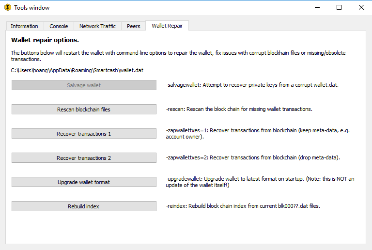

   The Wallet Repair tab of the SmartCash NodeClient Tools dialog

Salvage wallet
  Salvage wallet assumes wallet.dat is corrupted and cannot be read. It
  makes a copy of wallet.dat to wallet.<date>.bak and scans it to attempt
  to recover any private keys. Check your debug.log file after running
  salvage wallet and look for lines beginning with "Salvage" for more
  information on operations completed.

Rescan blockchain files
  Rescans the already downloaded blockchain for any transactions affecting
  accounts contained in the wallet. This may be necessary if you replace
  your wallet.dat file with a different wallet or a backup - the wallet
  logic will not know about these transactions, so a rescan is necessary
  to determine balances.

Recover transactions
  The recover transactions commands can be used to remove unconfirmed
  transactions from the memory pool. Your wallet will restart and rescan
  the blockchain, recovering existing transactions and removing
  unconfirmed transactions. Transactions may become stuck in an
  unconfirmed state if there is a conflict in protocol versions on the
  network during PrivateSend mixing, for example, or if a transaction is
  sent with insufficient fees when blocks are full.

Upgrade wallet format
  This command is available for very old wallets where an upgrade to the
  wallet version is required in addition to an update to the wallet
  software. You can view your current wallet version by running the
  ``getwalletinfo`` command in the console.

Rebuild index
  Discards the current blockchain and chainstate indexes (the database of
  unspent transaction outputs) and rebuilds it from existing block files.
  This can be useful to recover missing or stuck balances.
