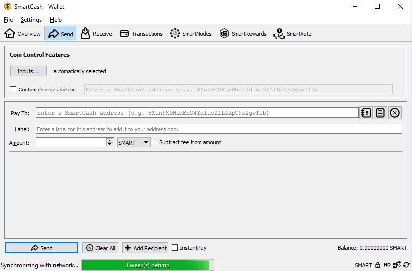
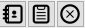
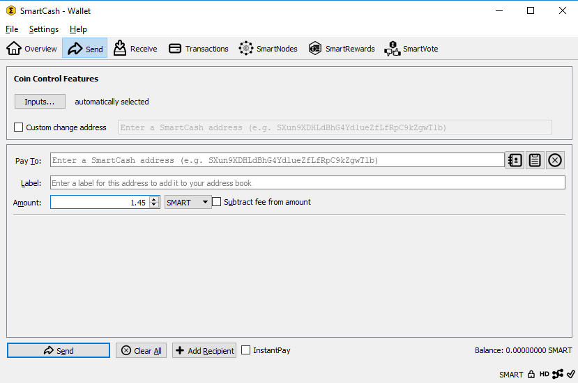
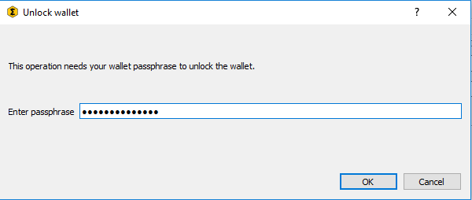
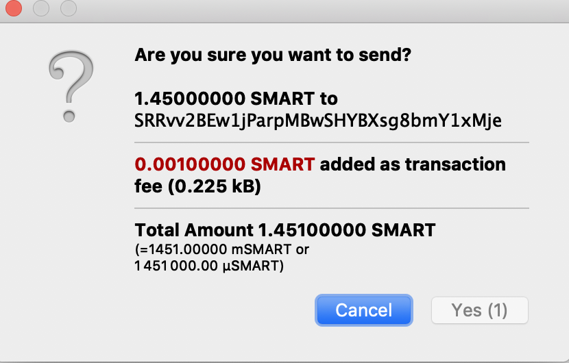
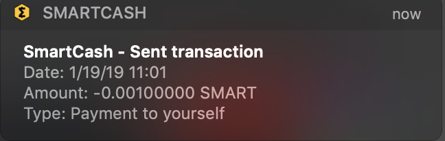
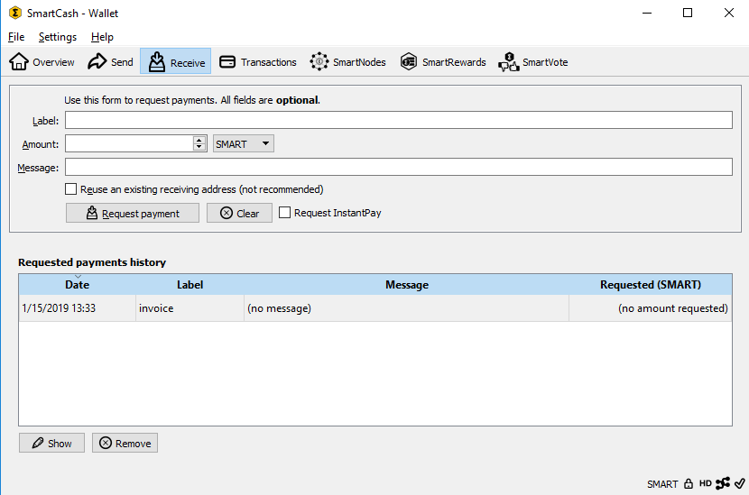
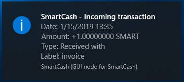
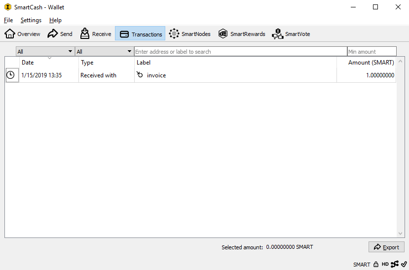

.. meta::
   :description: Guide to sending and receiving SmartCash using the SmartCash NodeClient wallet
   :keywords: SmartCash, core, wallet, send, receive, transaction

.. _nodeclient-send-receive:

=====================
Sending and receiving
=====================

Your SmartCash NodeClient Wallet is associated with a number of unique addresses
that can be used to send and receive SmartCash. Each address holds its own
balance, and the sum of all your balances is what appears on the
**Overview** tab. When you send SmartCash, your wallet will automatically
transfer funds from as many of your addresses as necessary to the
destination address, which is controlled by another SmartCash user and
associated with their wallet. You can control which addresses you use
using the Coin Control feature.

When you confirm a transaction, SmartCash NodeClient will enter the transaction in
a block, which will then be added to the blockchain for other clients to
confirm. A transaction is generally considered confirmed once six blocks
have been added after the block containing your transaction, although
smartnode and mining payments are only released after 101 blocks. Note
that a different process is used for instantpay
transactions.

SmartCash addresses are 34 characters long and begin with an uppercase S.

Sending SmartCash
=================

You can use SmartCash NodeClient to send SmartCash from your balance to another user.
The receiving user will provide you with a SmartCash address to which you
should send the funds. Click the **Send** tab in the tab bar and enter
the destination address in the **Pay To** field.

   The SmartCash NodeClient Send tab

You can also use the three icons |sendicons| to the right of the **Pay
To** field to select a previously used address, paste an address from
the clipboard, or clear the current address. If this is a new address,
you can enter a name for the address in the **Label** field to help
identify it again later. Finally, enter the amount of SmartCash you want to
transfer in the **Amount** field.

The other options relate to fees and instantpay. You can
choose if you want to pay the network fee in addition to the amount
sent, or subtract it from the amount sent. You can also increase your
fee to encourage nodes on the network to prioritize your transaction.
Choosing **instantpay** has a similar effect, but actually relies on a
different mechanism in the second layer network to speed up the
transaction time.

Let’s try an example. Say you have received an invoice which you now
want to pay with SmartCash. The writer of the invoice has included a SmartCash
address, which can be seen in the following window beginning with *Xpa*.
The invoice is for 1.45 SmartCash, which you fill in the **Amount** field.

   The Send tab filled out for a transaction

Once you have entered the destination address and the amount, click the
**Send** button. If you have encrypted your wallet, you will now be
required to enter your password to unlock the wallet.

   Entering the password to unlock the wallet

Finally, you are given one final confirmation and chance to cancel your
send transaction before SmartCash NodeClient processes the transaction on the
blockchain.

   Final confirmation window

If you respond with **Yes**, your transaction will be processed. Your
operating system may display a notification, and the transaction will
appear on the Transactions tab, where you can monitor its progress.

   The Windows 10 sent transaction confirmation notification

Note that the amount of the transaction increased by .000045 SmartCash. This
is the transaction fee. In the next section, we will see what this
procedure looks like from the receiving side.

Receiving SmartCash
===================

To receive SmartCash, you must first create a receiving address to give to
the sending party. To do this, click **File > Receiving addresses**. The
**Receiving addresses** window appears.

   The Receiving addresses window

Either copy an existing address by clicking on the address and then the
**Copy** button, or create a new address by clicking the **New** button.
You can also edit an existing address by right clicking and selecting
**Edit** address from the context menu. Give this address to the person
who will send you SmartCash. Your wallet does not need to be open to receive
funds, but if it is, you can watch the transaction arrive in real time.
This is because your wallet constantly watches for new blocks on the
blockchain when it is open, and will recognize a new transaction
involving your receiving address when it occurs.

   The Windows 10 received transaction confirmation notification

Once you have been paid, you can see the balance both on the
**Overview** tab and on the **Transactions** tab.

   The received transaction

**How to Create New Receiving Addresses in SmartCashQT**
