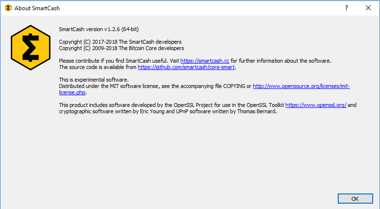
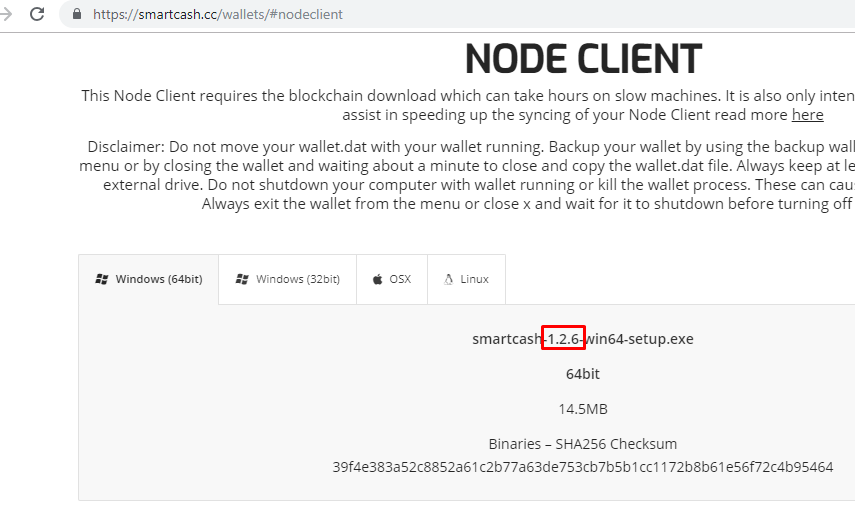

.. meta::
   :description: Recovering SmartCash wallets from files, private keys or recovery phrases
   :keywords: smartcash, wallet, recovery, password, lost, mobile, core, phrase, private key

.. _wallet-recovery:

===============
Wallet Recovery
===============

Long-time users of cryptocurrency sometimes find old wallet files on USB
drives or cloud storage that they have forgotten about. Others may have
a backup, but can't remember the software they used to create it, or
have forgotten the password. Other users may have an old version of SmartCash
Node Client that no longer works because the network has upgraded. This
documentation is intended to help these users restore access to their
funds.

Determining the backup format
=============================

The first step is to determine the format of your backup. In most cases,
this will either be a file, probably named *wallet.dat*, or a phrase of
words. In some cases, you may have stored the private key for a SmartCash
address directly. The following list shows the possibilities and methods
to restore your wallet in order of probability.

- Backup is stored in an older version of SmartCash Node Client that no longer works

  - Follow instructions for restoring wallet files using :ref:`SmartCash Node Client <nodeclient-restore>`

- Backup is a file

  - If file name is similar to wallet.dat, try to restore using :ref:`SmartCash Node Client <nodeclient-restore>`  

- Backup is a phrase of words

  - If 12 words long, try to restore using :ref:`SmartCash Electrum wallet <smartcash-electrum-phrase-restore>`
  - If 13 words long, try to restore using :ref:`SmartCash Electrum wallet <smartcash-electrum-phrase-restore>`
  - If 12, 18 or 24 or 25 words long, try to restore with the :ref:`hardware wallet <hardware-phrase-restore>` you used to create the recovery phrase

- Backup is a long string of random characters or a QR code

  - If 34 characters long and starting with S, this is a public address and cannot be used to restore access to lost funds. You need the private key.

- If 51 characters long and starting with V, this is a :ref:`private key in WIF <privkey-restore>`, import using SmartCash Node Client

Once you have determined your backup format, follow the links to view
the restore guide for that format.

File Backups
============

.. _nodeclient-restore:

SmartCash Node Client
---------

One of the most common wallet backup formats is a *wallet.dat* file from
SmartCash Node Client wallet. Before you begin, make absolutely sure that you have a
copy of this file stored somewhere safe in case the restore process
accidentally corrupts your wallet file! In most cases, *wallet.dat*
backups will also be protected by a password, which you will need to
know to regain access to your SmartCash funds. If you already have SmartCash Node Client
installed, first ensure it has been updated to the latest version by
clicking **Help > About SmartCash**. Compare this with the latest
available version of `SmartCash Node Client on the website
<https://smartcash.cc/wallet#nodeclient>`_ as follows:

   Comparing the installed version of SmartCash Node Client with the latest version
   available on the website

Update SmartCash Node Client to the latest version according to the
:ref:`installation instructions <nodeclient-installation>`. If you have
only a wallet file and no existing installation of SmartCash Node Client, simply
install SmartCash Node Client according to the :ref:`installation instructions
<nodeclient-installation>` and start it once to create the SmartCash
folder. Then close SmartCash Node Client and copy the *wallet.dat* file you want to
restore to the SmartCash folder in the location specified below,
replacing or renaming the existing file.

+----------+--------------------------------+-----------------------------------------------------------------------------------------------+
| Platform | Path to data folder            | How to navigate                                                                               |
+==========+================================+===============================================================================================+
| Linux    | ~/                             | Go to your home folder and press **Ctrl+H** to show hidden files, then open ``.smartcash``     |
+----------+--------------------------------+-----------------------------------------------------------------------------------------------+
| macOS    | ~/Library/Application Support/ | Press **Shift + Control + G**, type ``~/Library/Application Support``, then open ``SmartCash`` |
+----------+--------------------------------+-----------------------------------------------------------------------------------------------+
| Windows  | %APPDATA%                      | Press **Windows Key + R** and type ``%APPDATA%``, then open ``SmartCash``                      |
+----------+--------------------------------+-----------------------------------------------------------------------------------------------+

To repair a broken installation, navigate to the SmartCash folder and
delete all *.log* and *.dat* files except *wallet.dat*. The following
files can be safely deleted:

- *banlist.dat*
- *db.log*
- *debug.log*
- *fee_estimates.dat*
- *version.dat*
- *snpayments.dat*
- *netfulfilled.dat*
- *peers.dat*

Leave ``.conf`` files and the folders (such as ``backups``, ``blocks``,
``chainstate``, etc.) intact, since they will help you get started
faster by providing a copy of the blockchain and your settings.

Now open SmartCash Node Client and wait for blockchain synchronization to complete.
Your wallet will be restored/upgraded and all balances should be
displayed. You should ensure you have the correct password by trying to
unlock your wallet from **Settings > Unlock Wallet** to make sure you
can actually create transactions using your balances. If you have any
problems with your balance not appearing, try to force a rescan of the
blockchain by going to **Help > Debug Windows >Wallet Repair** and selecting **Rescan
blockchain files**. **Rebuild index** may also help. SmartCash Node Client will
restart and perform a full scan of the blockchain.

At this stage, recovery is complete and you should make another backup
using **File > Backup Wallet** or following the instructions :ref:`here
<nodeclient-backup>`. If you have any further problems, try asking on the
`discord <http://discord.smartcash.cc/>`_, `Reddit <https://www.reddit.com/r/smartcash/>`_ or the

Recovery Phrases
================

.. _smartcash-electrum-phrase-restore:

12/13-word phrase on SmartCash Electrum
----------------------------------

Ensure you are using the latest version of SmartCash Electrum according to
the installation instructions :ref:`here <electrum-installation>`. SmartCash
Electrum supports multiple simultaneous wallets, so you can safely
restore to a new wallet file without losing your old wallet. Click
**File > New/Restore** and enter a file name to store your new wallet.
Then select **I already have a seed** and enter your 12/13-word recovery
phrase. Enter a new password for your wallet and click **Next** to
recover your addresses from the recovery phrase.

.. _hardware-phrase-restore:

Hardware wallet recovery phrases
--------------------------------

If your 12, 18 or 24-word recovery phrase was generated by a hardware
wallet, follow these instructions:

- `Ledger Nano S <https://support.ledgerwallet.com/hc/en-us/articles/360005434914-Restore-a-configuration>`_
- `Trezor <https://doc.satoshilabs.com/trezor-user/recovery.html>`_

.. _privkey-restore:

Private Keys
============

Most wallets offer a function to import an address from a private key,
see the documentation for your wallet for specific instructions. While
private keys can be stored in many ways, in this example we will work
through the process of restoring a private key from a paper wallet using
SmartCash Node Client. If you only have a QR code and not the key, use a barcode
scanning app (`Android <https://play.google.com/store/apps/details?id=com.google.zxing.client.android>`_
or `iOS <https://itunes.apple.com/us/app/quick-scan-qr-code-reader/id483336864>`_) 
to read the code first.

First, start SmartCash Node Client and unlock your wallet by selecting **Settings >
Unlock Wallet**. Enter your password, then open the debug console by
selecting **Help > Debug Windows**. In the console, type the following,
replacing the example private key with your key::

  importprivkey VrPQWnMrh3oWLtZrzt1zLRSCVyuBbwnt7fRBXPp2EwcPhtzXSzp

   Importing a private key using the debug console in SmartCash Node Client wallet

SmartCash Node Client will rescan the blockchain for transactions involving the
public address of this key and enter the transactions and balance in
your wallet.

Forgotten Passwords
===================

In most cases, if you selected a strong password and have forgotten or
lost it, there is practically no hope of recovery. The encryption used
by the SmartCash wallets is extremely strong by design, and a well-chosen
password should defeat most brute force cracking attempts. If you can
recall some details of the password, particularly its length or
sequences of characters that may be included, then brute force password
cracking techniques may be worth attempting. Several services exist to
do this, or you can attempt it yourself. Because SmartCash Node Client is based on
Bitcoin Core, most approaches to apply brute force to crack a Bitcoin
wallet will also work for SmartCash wallets.

- `Wallet Recovery Services <https://walletrecoveryservices.com>`_
- `BTCRecover <https://github.com/gurnec/btcrecover>`_
