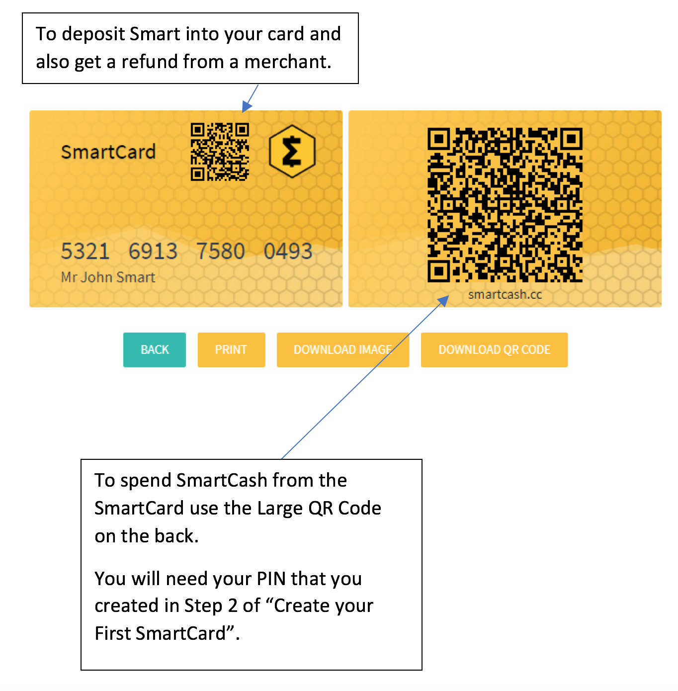

.. meta::
   :description: Getting started with sending and receiving SmartCash using SmartCard
   :keywords: smart, wallet, ios, android, installation, send, receive, addresses, getting started

.. _smartcard-getting-started:

===============
Getting Started
===============

The SmartCard is a way to hold SMART on a physical card. You don’t need a phone to hold your SMART.
If you have ever had a problem with using a phone inside a building you will get why this is ideal.
Only the merchant needs the internet connection.
As simple to use as a credit or debit card but not controlled by any 3rd party processor.
And not a preloaded card using a visa fiat system…this is real crypto to crypto.

The easiest way to install the SmartCard for Android is from the
Google Play Store.

.. image:: img/google-play.png
    :width: 250 px
    :target: https://play.google.com/store/apps/details?id=cc.smartcash.smartcard

.. _smartcard-installation:

Installation
============

Creat the SmartCard 
https://card.smartcash.cc/

`All in One - SmartCard Guide <https://smartcash.freshdesk.com/support/solutions/articles/35000085219-all-in-one-smartcard-guide>`_ 

Deposit
========

Scan QR code to show SmartCash address and send smartcash to it.

Sending
=======

Show your smartcard at merchant. Merchant will use smartpay app to scan smartcard.
You will enter the PIN to confirm transactions.

Viewing transactions and balances
=================================

Using explorer to check your transactions details with your smartcash address `explorer <https://explorer.smartcash.cc>`_

Security FAQ
============

Breaking QR if stolen: We use BIP38 encryption that is executed in each own device (browser and app in the future). Encryption generates for each card: random bytes and unique decryptionKey (GUID) hashed with Keccak-256.

Private key then is encrypted with AES256 with decryptionKey hash and random bytes. So even if one QR Key is "cracked", all other Encrypted Keys are safe because random bytes and decryption key (GUID) are unique and almost impossible to duplicate. Each QR decryption takes about 1 second in modern CPU, David calculated how many years would take if we could do 1000 hashes per second. ((32^16) / 100 000 000) * seconds = 383 093 658 years to crack each QR

SmartPay Tempering: first you should do business with whom you trust and second tempering with the SmartPay or POS in the future, it takes at least the same tempering effort than any other payment terminal out there. Communication between SmartPay and Card API is encrypted and with a secret authorization which only the official application build has. That's why Card Name verification allows to guarantee Card API communication is authentic. If people have an hidden camera recording the device, they could record the same way any bank card front/back.

Payment Protection: on top of this, with SmartCard you can activate and reset your PIN on the fly, which you can't do with most bank cards. So you could transact and change PIN right after or just activate/deactivate card at payment time.

Security in SmartPay
--------------------

Protection of Card Data:
Captured card data (QR/NFC) is not stored in the device and SmartPay has protections against common attacks.

PIN Security:
We have built a secure customised PIN pad that reinforces keylogger protection and keys are randomised with each use.

SmartPay Authenticity:
While paying card holders should check in the PIN screen that "Verify Card Name" matches the card name.

Mandatory Updates:
SmartPay requires to be using it's latest released version, ensuring SmartPay is always updated.
