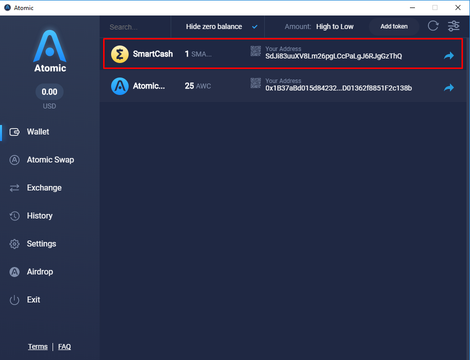
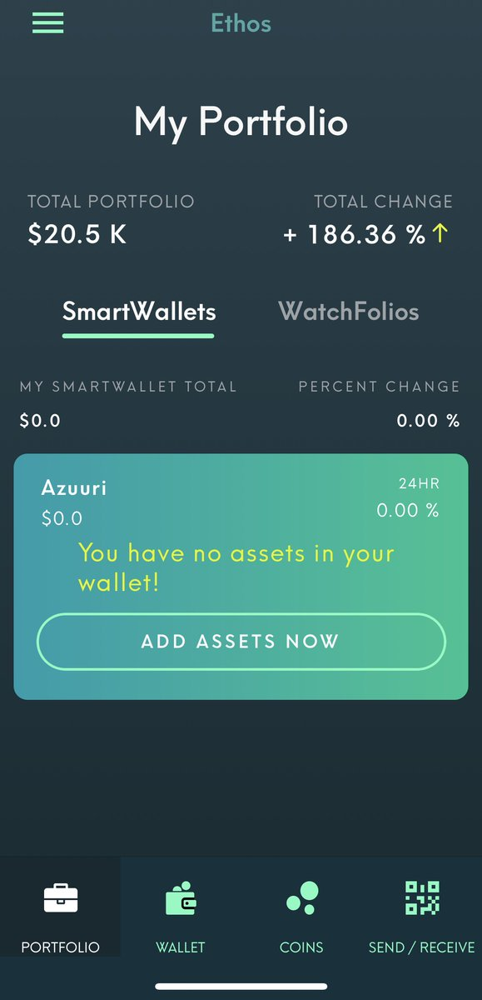
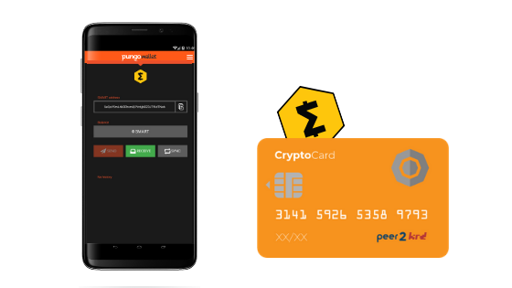

.. meta::
   :description: List and detailed information on third-party wallets supporting the SmartCash cryptocurrency
   :keywords: smartcash, wallet, mobile, edge, ethos, mobi,  atomic,  coinomi

.. _smartcash-third-party:

Introduction
============

The SmartCash protocol and many SmartCash products such as SmartCash NodeClient are entirely open source, which makes it easy for third
parties to integrate SmartCash with their existing cryptocurrency wallet
solutions. This section describes some of the third party wallets
available and the functions they offer. Please note that SmartCash does not
provide support for any of these wallets, and any listing here should
not be considered an endorsement or recommendation. Contact the software
vendor for support.

Atomic Wallet
=============

https://atomicwallet.io

.. image:: img/atomic.png
   :width: 100px
   :align: right
   :target: https://atomicwallet.io

Atomic Wallet is a multi-asset custody-free wallet with atomic swap
exchange and decentralized orderbook functionality. It provides a
powerful, secure service that transparently and reliablly allows users
to reduce effort spent on managing and exchanging crypto assets​.

Installation
------------

All Atomic Wallet releases are available from https://atomicwallet.io -
simply download and install the appropriate package for your system.

Documentation
-------------

Atomic Wallet offers detailed documentation of all functions at
https://atomicwallet.freshdesk.com and a few quick links are also
collected here:

- `Getting started with Atomic Wallet <https://atomicwallet.freshdesk.com/support/solutions/articles/36000066359-getting-started-with-atomic-wallet>`_
- `How to install Atomic Wallet <https://atomicwallet.freshdesk.com/support/solutions/articles/36000066351-how-to-install-atomic-wallet->`_
- `How to create a wallet <https://atomicwallet.freshdesk.com/support/solutions/articles/36000066354-how-to-create-a-wallet->`_
- `Getting started with Atomic Swaps <https://atomicwallet.freshdesk.com/support/solutions/articles/36000073262-getting-started-with-atomic-swaps>`_

   Atomic Wallet Portfolio screen

Coinomi
=======

https://coinomi.com

.. image:: img/coinomi.png
   :width: 100px
   :align: right
   :target: https://coinomi.com

Coinomi is an open-source multi-currency mobile wallet available for iOS
and Android. Your private keys never leave your device, and strong
wallet encryption guarantees that your funds are always under your
control only. Instant exchange is available directly in the wallet
through ShapeShift and Changelly integrations.

Download
--------

.. image:: img/app-store.png
   :width: 180px
   :target: https://itunes.apple.com/us/app/coinomi-wallet/id1333588809

.. image:: img/google-play-badge.png
   :width: 200px
   :target: https://play.google.com/store/apps/details?id=com.coinomi.wallet

Coinomi is available from the `Google Play Store for Android
<https://play.google.com/store/apps/details?id=com.coinomi.wallet>`__
and the `Apple App Store for iOS
<https://itunes.apple.com/us/app/coinomi- wallet/id1333588809>`__.

Documentation
-------------

Coinomi offers detailed documentation of all functions at
https://coinomi.freshdesk.com 

.. figure:: img/coinomi-wallet.png
   :width: 300px

   Coinomi wallet running on Android

Edge
====

https://edgesecure.co

.. image:: img/edge.png
   :width: 100px
   :align: right
   :target: https://edgesecure.co

Edge is a secure multi-currency wallet for iOS and Android. It offers a
unique login system to store your encrypted HD seed on the cloud while
still performing all sensitive operations requiring a private key on
your device. Edge is fast and simple to use, allowing you to scan QR
codes and sign transactions using your fingerprint ID or a simple PIN
code. ShapeShift is also integrated to facilitate exchange between
different cryptocurrencies.

Installation
------------

.. image:: img/app-store.png
   :width: 180px
   :target: https://itunes.apple.com/us/app/edge-bitcoin-wallet/id1344400091

.. image:: img/google-play-badge.png
   :width: 200px
   :target: https://play.google.com/store/apps/details?id=co.edgesecure.app

Edge is available from the `Google Play Store for Android
<https://play.google.com/store/apps/details?id=co.edgesecure.app>`__ and
the `Apple App Store for iOS <https://itunes.apple.com/us/app/edge-
bitcoin-wallet/id1344400091>`__.

Documentation
-------------

Edge offers detailed documentation of all functions at
https://support.edgesecure.co and a few quick links are also collected
here:

- `Getting started <https://support.edgesecure.co/support/solutions/8000051596>`__
- `How do I create a new wallet? <https://support.edgesecure.co/support/solutions/8000051596>`_
- `How do I send money? <https://support.edgesecure.co/support/solutions/articles/8000058750>`_
- `How do I receive money into my account? <https://support.edgesecure.co/support/solutions/articles/8000058749>`_
- `What is ShapeShift and how does it work? <https://support.edgesecure.co/support/solutions/articles/8000060525>`_

.. figure:: img/edge-wallet.png
   :width: 400px

   Edge Welcome, Receive SmartCash and Balance screens

Ethos
=====

https://www.ethos.io

.. image:: img/ethos.png
   :width: 100px
   :align: right
   :target: https://www.ethos.io

The Ethos Universal Wallet allows you to store SmartCash and over 100 other
cryptocurrencies. It features a single recovery phrase, known as the
SmartKey, with which you can restore all balances on another device.
Features include human-readable usernames, ShapeShift coin conversion
and a portfolio tracker.

Installation
------------

.. image:: img/app-store.png
   :width: 180px
   :target: https://itunes.apple.com/us/app/ethos-universal-wallet/id1376959464

.. image:: img/google-play-badge.png
   :width: 200px
   :target: https://play.google.com/store/apps/details?id=io.ethos.universalwallet

Ethos Universal Wallet is available from the `Google Play Store for Android 
<https://play.google.com/store/apps/details?id=io.ethos.universalwallet>`__ 
and the `Apple App Store for iOS
<https://itunes.apple.com/us/app/ethos-universal-wallet/id1376959464>`__.

Documentation
-------------

Ethos offers detailed documentation of all functions at
https://support.ethos.io and a few quick links are also collected
here:

- `How to Create and Ethos Account <https://support.ethos.io/support/solutions/articles/35000081037-how-to-create-an-ethos-account>`__
- `How to Create Your SmartKey and First SmartWallet <https://support.ethos.io/support/solutions/articles/35000077327-how-to-create-your-smartkey-and-first-smartwallet>`_
- `How to Add Coins to a SmartWallet <https://support.ethos.io/support/solutions/articles/35000077328-how-to-add-coins-to-a-smartwallet>`_
- `How to Receive Cryptocurrency to a SmartWallet <https://support.ethos.io/support/solutions/articles/35000077329-how-to-receive-cryptocurrency-to-a-smartwallet>`_
- `How to Send Cryptocurrency from the SmartWallet <https://support.ethos.io/support/solutions/articles/35000082787-how-to-send-cryptocurrency-from-the-smartwallet>`_

   Ethos Universal Wallet on Android

Pungo
=====

https://pungo.app/

Pungo Wallet is focused on ease of use, security, and especially on maintaining the end user's financial independence as it’s a noncustodial wallet. Our company never has access to the user’s funds.
Pungo Wallet offers a multicrypto wallet which supports a growing amount of coins. We provide a built-in fiat gateway to be able to buy and sell from the wallet through convenient methods. We also provide a debit card which can be ordered and loaded from the wallet interface. Our goal is to become a gateway for blockchain based services and a reference wallet for those users searching for independence from mainstream financial solutions by providing a full set of convenient services seamlessly integrated within the wallet.

Installation
------------

.. image:: img/google-play-badge.png
   :width: 200px
   :target: https://play.google.com/store/apps/details?id=cloud.peer2.pungo_wallet

Pungo Wallet is available from the `Google Play Store for Android 
<https://play.google.com/store/apps/details?id=cloud.peer2.pungo_wallet>`__ 

Documentation
-------------

Pungo Wallet offers detailed documentation of all functions at <https://pungo.app>_

   
  Pungo Wallet on Android
  