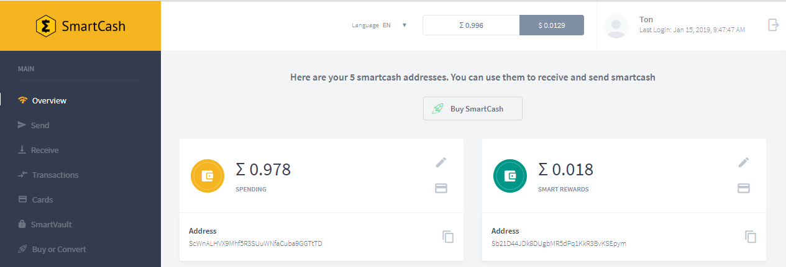

.. meta::
   :description: WebWallet is a secure web wallet for SmartCash, supporting instantpay
   :keywords: smartcash, WebWallet, web, wallet, instantpay

.. _smartcash-web-wallet:

WebWallet
============

`WebWallet <https://wallet.smartcash.cc>`_ is a web interface to the
SmartCash blockchain. It is explicitly not an online wallet,
meaning you maintain control over your private keys at all times. Unlike
many other light wallets, WebWallet also supports advanced SmartCash
features such as instantpay, voting, smartvault, smartcard, by or convert.

WebWallet offers complete and detailed documentation for all functions.

- `All about web wallet <https://smartcash.freshdesk.com/support/solutions/folders/35000162353>`_
- `WebWallet New Account Registration <https://smartcash.freshdesk.com/support/solutions/articles/35000008894>`_
- `How to Send Smart from your WebWallet <https://smartcash.freshdesk.com/support/solutions/articles/35000012411-how-to-send-smart-from-your-webwallet>`_
- `How to import privatekey from webwallet to desktop wallet and viceversa <https://smartcash.freshdesk.com/support/solutions/articles/35000027148>`_

